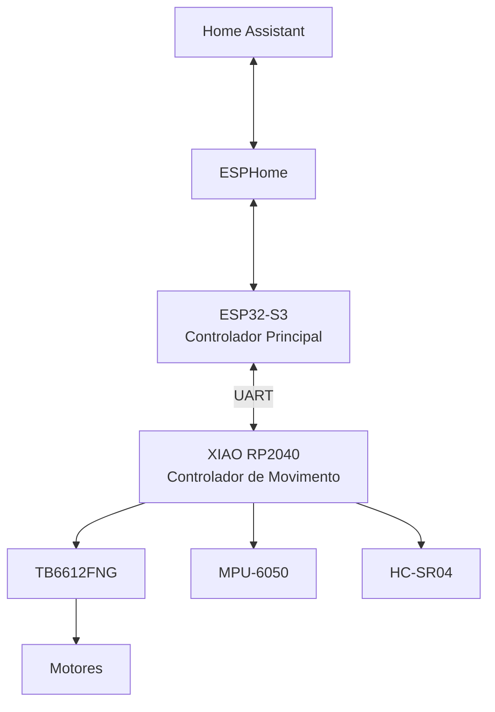
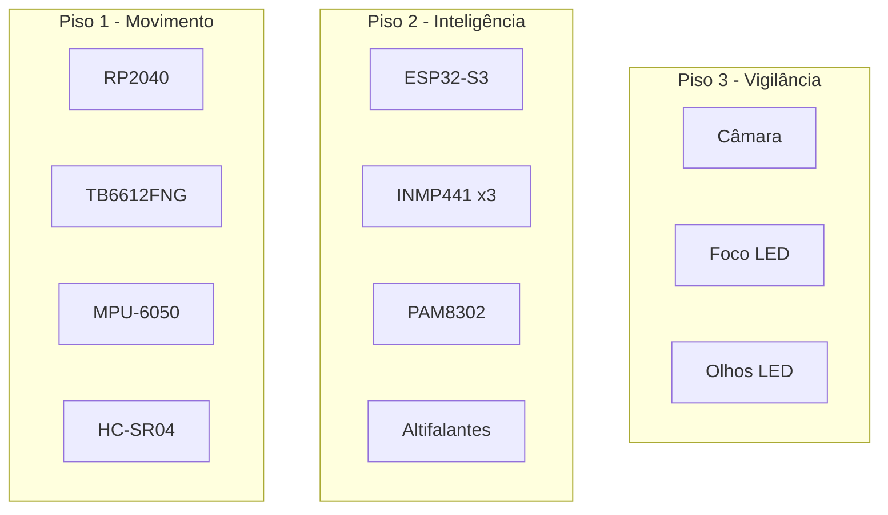
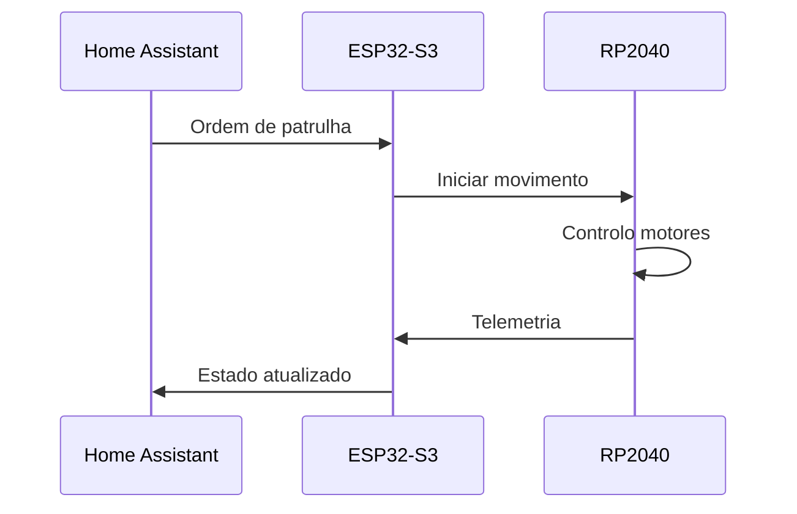
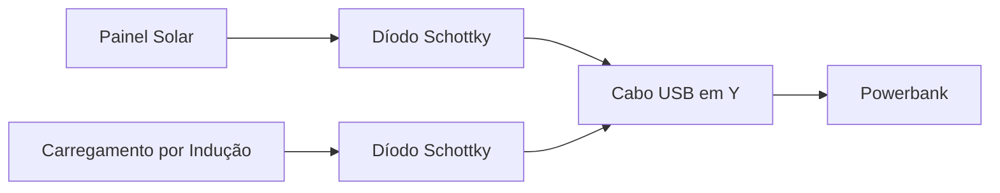
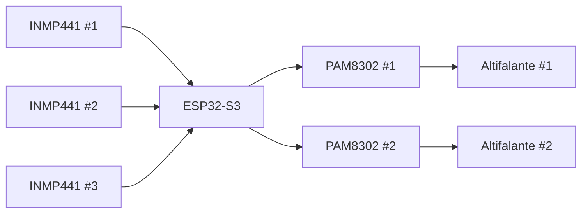
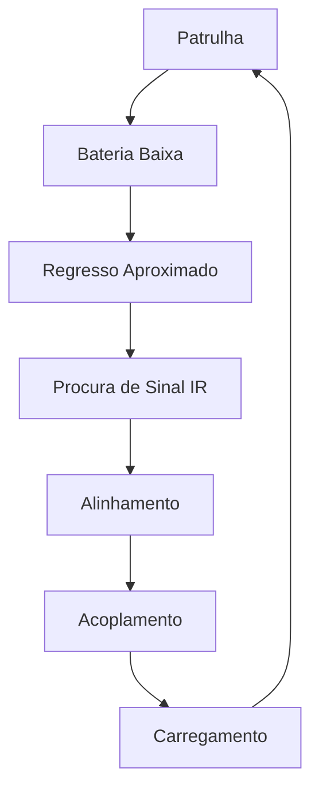
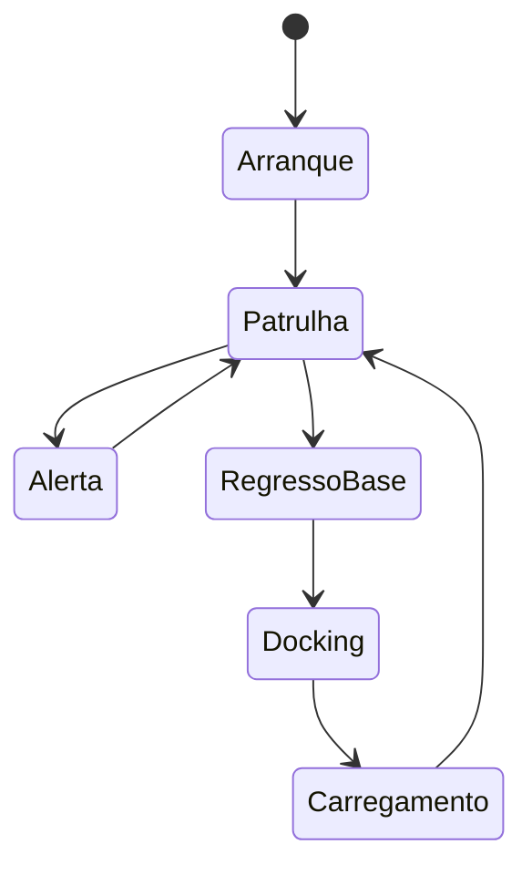

## Arquitetura Global

## Estrutura Física

## Fluxo de Controlo

## Arquitetura de Energia

### Isolamento das Fontes

O sistema utiliza dois díodos Schottky independentes:

- um para o painel solar;
- um para o carregamento por indução.

Os díodos impedem corrente inversa entre fontes e permitem que ambas alimentem o powerbank através do cabo USB em Y.

Objetivos:

- proteger os módulos de alimentação;
- impedir circulação de corrente entre fontes;
- permitir operação simultânea sem conflitos elétricos;
- preservar a modularidade do sistema energético.

## Arquitetura de Áudio

## Estratégia de Docking

## Roadmap Técnico

## Estados Operacionais

