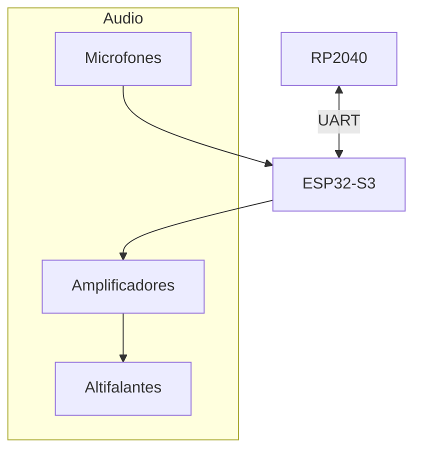
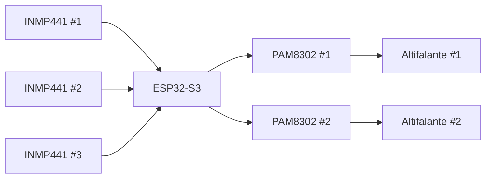
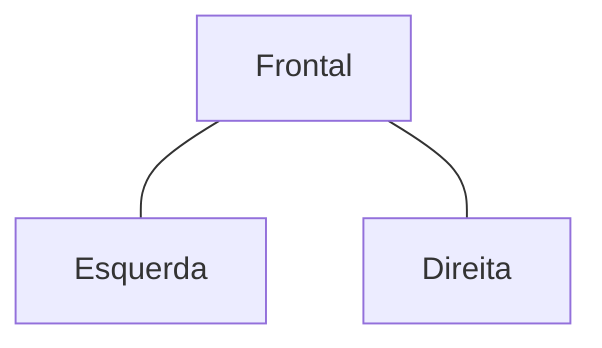
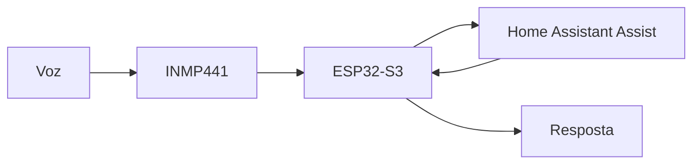
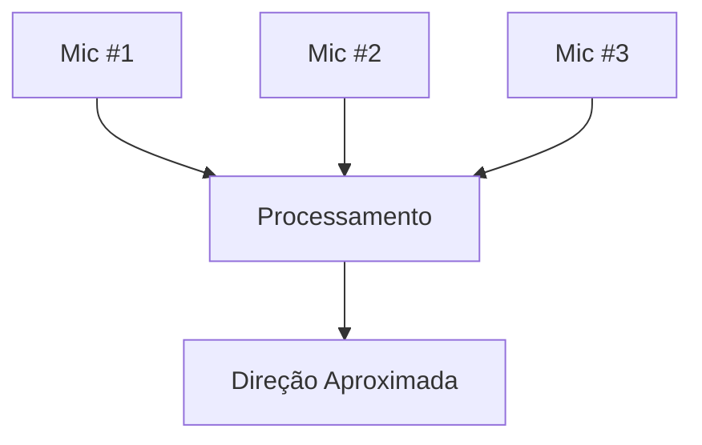

# Audio System

> AEGIS - Audio Capture, Processing and Playback Architecture

Versão: 1.0
Estado: Arquitetura Definida

---

# Objetivo

O sistema de áudio do AEGIS tem como objetivo permitir:

- interação por voz;
- integração com Home Assistant Assist;
- reprodução de alertas;
- comunicação bidirecional;
- futura localização aproximada de fontes sonoras.

---

# Filosofia

O sistema de áudio encontra-se totalmente centralizado no ESP32-S3.

O RP2040 não participa no processamento de áudio.



---

# Arquitetura Geral



---

# Sistema de Captura

## Microfones

Hardware:

- INMP441 ×3

Tipo:

- MEMS
- I²S digital

---

# Disposição Física

A disposição prevista privilegia cobertura espacial.



Representação conceptual:

```text
         Frente

           M1

     M2         M3
```

---

# Objetivos da Disposição

## Curto Prazo

- captação uniforme de voz;
- redução de zonas mortas.

---

## Médio Prazo

- deteção aproximada da direção do som.

---

## Longo Prazo

- seguimento sonoro;
- deteção inteligente de eventos.

---

# Interface I²S

O barramento I²S será utilizado para:

- captura dos INMP441;
- reprodução áudio.


---

# Sistema de Reprodução

## Amplificação

Hardware:

- PAM8302 ×2

---

## Altifalantes

Hardware:

- 3W
- 8Ω

Quantidade:

- 2

---

# Funções de Reprodução

## Fase Inicial

- sons de arranque;
- avisos;
- notificações.

---

## Fase Intermédia

- reprodução de mensagens;
- reprodução TTS.

---

## Fase Avançada

- comunicação bidirecional;
- intercomunicador remoto.

---

# Integração Home Assistant

## Arquitetura


---

# Integração Assist

Objetivo:

Transformar o AEGIS num terminal móvel do Assist.



---

# Roadmap de Funcionalidades

## Fase 1

- reprodução de áudio;
- testes de amplificação.

---

## Fase 2

- captura de áudio;
- validação dos microfones.

---

## Fase 3

- integração ESPHome.

---

## Fase 4

- Assist.

---

## Fase 5

- comunicação bidirecional.

---

## Fase 6

- localização sonora.

---

# Casos de Utilização

## Alertas

Exemplos:

- bateria baixa;
- início de patrulha;
- regresso à base.

---

## Assistente de Voz

Exemplos:

- perguntas ao Assist;
- comandos domésticos;
- consultas Home Assistant.

---

## Intercomunicador

Exemplos:

- ouvir ambiente;
- falar através do robô.

---

# Evoluções Futuras

## Localização de Fonte Sonora

Objetivo:

Determinar a direção aproximada de origem de um som.



---

## Eventos Inteligentes

Deteções possíveis:

- campainha;
- alarmes;
- sons anómalos;
- chamadas de voz.

---

# Critérios de Sucesso

O sistema será considerado concluído quando:

- [ ] Os altifalantes reproduzem áudio.
- [ ] Os microfones captam voz com clareza.
- [ ] A integração com ESPHome está operacional.
- [ ] O Assist funciona através do robô.
- [ ] É possível comunicação bidirecional.
- [ ] O sistema opera de forma estável durante longos períodos.

---

# Notas de Projeto

O subsistema de áudio é um dos principais motivos para a utilização do ESP32-S3.

A arquitetura foi concebida para evoluir progressivamente:

1. Reprodução áudio
2. Captura áudio
3. Assist
4. Comunicação bidirecional
5. Localização sonora

Sem necessidade de alterações estruturais ao hardware principal.
