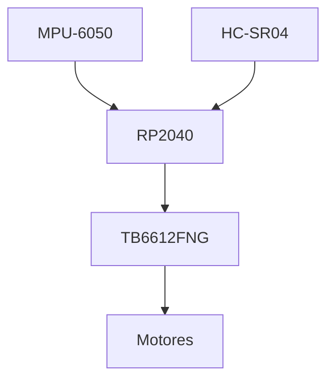
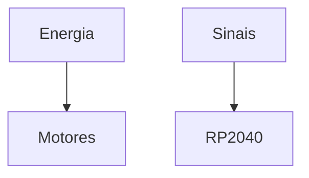

# Block 01 Build Guide

> AEGIS - Block 01 Assembly Guide

Versão: 1.0
Estado: Planeamento

---

# Objetivo

O Block 01 representa a primeira etapa funcional do projeto AEGIS.

Nesta fase será criada uma plataforma autónoma capaz de:

- mover-se;
- evitar obstáculos;
- medir orientação;
- comunicar internamente.

O objetivo é validar a camada de movimento antes da integração dos restantes subsistemas.

---

# Âmbito

Incluído:

- XIAO RP2040
- TB6612FNG
- MPU-6050
- HC-SR04
- Motores
- Chassis

Não incluído:

- ESP32-S3
- Câmara
- Áudio
- Docking
- Home Assistant

---

# Arquitetura



---

# Objetivos de Validação

A plataforma deverá ser capaz de:

- avançar;
- recuar;
- rodar;
- parar;
- detetar obstáculos;
- reportar orientação.

---

# Componentes Necessários

## Controladores

- XIAO RP2040
- Expansion Board RP2040

---

## Movimento

- TB6612FNG
- Motores DC
- Rodas

---

## Sensores

- MPU-6050
- HC-SR04

---

## Energia

- Powerbank

---

## Estrutura

- Chassis base
- Espaçadores
- Elementos de fixação

---

# Sequência de Montagem


---

# Passo 1 - Preparar o Chassis

## Objetivos

- verificar alinhamento;
- verificar rodas;
- verificar espaço disponível.

---

## Verificações

- rodas livres;
- sem interferências mecânicas;
- espaço para cablagem.

---

# Passo 2 - Instalar Motores

## Objetivos

Montar:

- motores;
- suportes;
- rodas.

---

## Verificações

- rotação livre;
- parafusos apertados;
- alinhamento correto.

---

# Passo 3 - Instalar TB6612FNG

## Objetivos

Montar driver de motores.

---

## Requisitos

- acesso fácil;
- proximidade ao RP2040;
- cablagem curta.

---

# Passo 4 - Instalar RP2040

## Objetivos

Montar:

- XIAO RP2040;
- Expansion Board.

---

## Requisitos

- acessível para programação;
- acesso USB fácil.

---

# Passo 5 - Instalar MPU-6050

## Posição

Próximo do centro geométrico.

---

## Justificação

Reduz erros provocados por:

- aceleração;
- vibração;
- rotação.

---

# Passo 6 - Instalar HC-SR04

## Posição

Frente do robô.

---

## Objetivo

Deteção de obstáculos.

---

## Campo de Visão

```text
      Frente

         /\
        /  \
       /    \

       HC-SR04
```

---

# Cablagem

## Princípios

- cabos curtos;
- evitar cruzamentos;
- separar potência e sinais.

---

## Organização



---

# Ensaios Mecânicos

## Teste 1

Movimento manual das rodas.

Resultado:

```text
Pendente
```

---

## Teste 2

Estabilidade da estrutura.

Resultado:

```text
Pendente
```

---

# Ensaios Elétricos

## Teste 1

Alimentação do RP2040.

Resultado:

```text
Pendente
```

---

## Teste 2

Comunicação I²C com MPU-6050.

Resultado:

```text
Pendente
```

---

## Teste 3

Leitura HC-SR04.

Resultado:

```text
Pendente
```

---

# Ensaios Funcionais

## Movimento

- [ ] Frente
- [ ] Trás
- [ ] Esquerda
- [ ] Direita
- [ ] Stop

---

## Sensores

- [ ] MPU-6050 funcional
- [ ] HC-SR04 funcional

---

# Critérios de Conclusão

O Block 01 será considerado concluído quando:

- [ ] Movimento básico funcional.
- [ ] Sensores funcionais.
- [ ] Estrutura estável.
- [ ] Cablagem organizada.
- [ ] Alimentação estável.
- [ ] Testes concluídos.

---

# Documentos Relacionados

- architecture.md
- motor-platform.md
- gpio-allocation.md
- sensors.md
- power-system.md
- physical-layout.md

---

# Próximo Bloco

Após conclusão do Block 01:

```text
Block 02
Docking e Navegação
```

O objetivo é adicionar capacidades de localização da base e preparação para carregamento autónomo.
