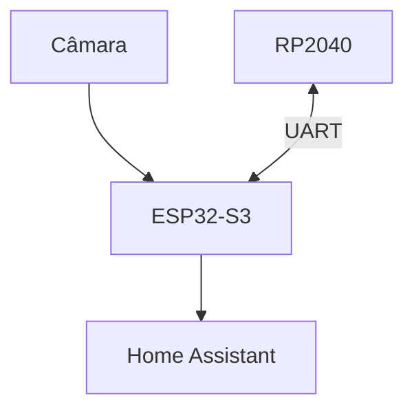
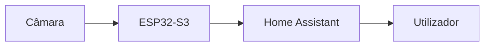
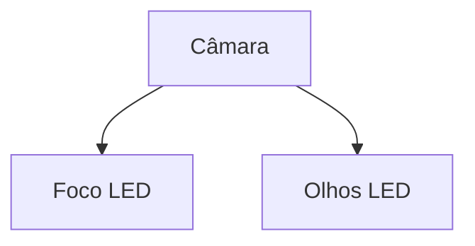
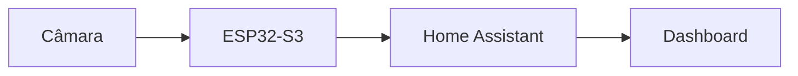
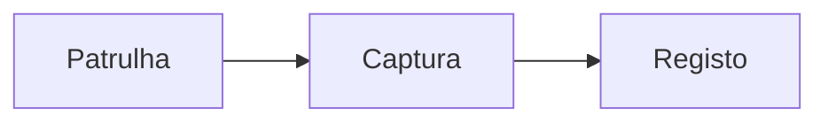
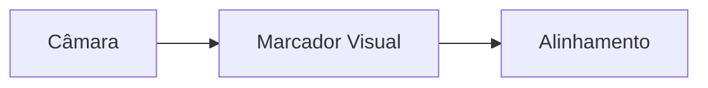
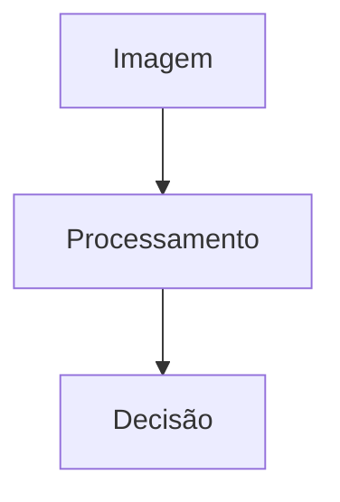

# Camera System

> AEGIS - Vision and Video Architecture

Versão: 1.0
Estado: Arquitetura Definida

---

# Objetivo

O sistema de visão do AEGIS tem como objetivo fornecer:

- vigilância remota;
- streaming de vídeo em tempo real;
- monitorização da habitação;
- apoio ao docking autónomo;
- futuras capacidades de visão computacional.

---

# Filosofia

A câmara é considerada um sensor avançado.

Ao contrário dos sensores de navegação de baixo nível, o processamento de imagem não deve interferir com:

- movimento;
- docking;
- segurança do sistema.

Por esse motivo, todo o sistema visual encontra-se associado ao ESP32-S3.



---

# Arquitetura Geral



---

# Componentes

## Câmara

Quantidade:

- 1

Estado:

- Modelo definitivo por selecionar

Responsabilidades:

- captura de vídeo
- apoio à navegação visual
- vigilância

---

## Processamento

Responsável:

- ESP32-S3

Funções:

- aquisição de imagem
- streaming
- controlo da câmara
- interface Home Assistant

---

## Iluminação

Componentes:

- Foco LED frontal

Funções:

- iluminação em condições de baixa luminosidade
- auxílio à vigilância

---

# Estrutura Física

## Posição Prevista

A câmara deverá ser colocada na zona superior do robô.



Representação conceptual:

```text
      Olho      Olho

         Câmara

          Foco
```

---

# Modos de Funcionamento

## Modo Vigilância

Objetivo:

- observar ambiente;
- transmitir vídeo para Home Assistant.

---

## Modo Inspeção

Objetivo:

- controlo remoto;
- deslocação manual.

---

## Modo Docking

Objetivo:

- validação visual da estação;
- alinhamento futuro.

---

# Integração Home Assistant

## Fluxo



---

## Funcionalidades Previstas

- visualização em direto;
- gravação;
- snapshots;
- integração com dashboards;
- automações relacionadas com imagem.

---

# Integração com Patrulha



---

# Integração com Docking

## Situação Atual

A estratégia principal utiliza:

- IMU;
- IR;
- HC-SR04.

---

## Evolução Futura

A câmara poderá validar a posição da estação.



---

# Marcadores Visuais

Tecnologias candidatas:

- ArUco Marker
- QR Code
- Marcador personalizado

---

# Capacidades Futuras

## Reconhecimento Visual

Possibilidades:

- estação de carregamento;
- portas;
- zonas da habitação;
- obstáculos.

---

## Navegação Assistida por Visão



---

## Visão Computacional

Possíveis evoluções:

- deteção de movimento;
- identificação de objetos;
- deteção de eventos.

---

# Roadmap

## Fase 1

- instalação física da câmara
- streaming básico

---

## Fase 2

- integração Home Assistant
- snapshots

---

## Fase 3

- gravação
- eventos

---

## Fase 4

- apoio ao docking

---

## Fase 5

- marcadores visuais

---

## Fase 6

- visão computacional

---

# Critérios de Sucesso

O sistema será considerado concluído quando:

- [ ] Existe vídeo em tempo real.
- [ ] Home Assistant apresenta a imagem.
- [ ] O foco LED funciona corretamente.
- [ ] O sistema opera de forma estável.
- [ ] A câmara pode apoiar o docking.
- [ ] A arquitetura suporta futuras evoluções.

---

# Notas de Projeto

A câmara não é considerada um componente crítico para:

- movimento;
- docking inicial;
- segurança básica.

O AEGIS deverá continuar perfeitamente operacional sem a câmara.

A visão computacional será tratada como uma camada adicional de capacidades e não como uma dependência estrutural do robô.

A arquitetura foi concebida para permitir evolução gradual desde simples streaming até funcionalidades avançadas de visão assistida.
