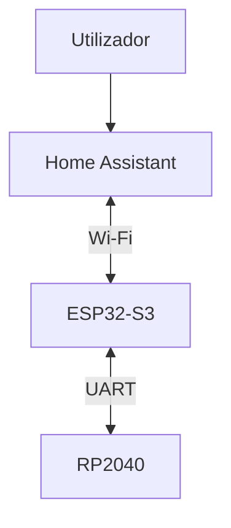
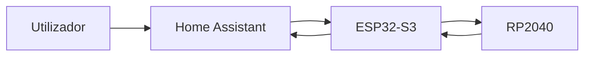
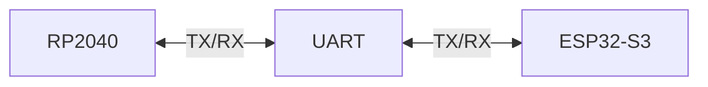
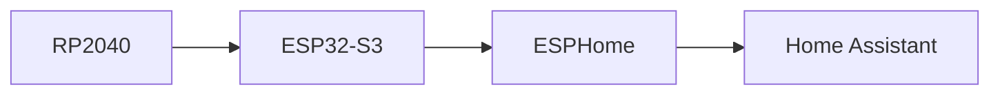

# Communication System

> AEGIS - Communication Architecture

Versão: 1.0
Estado: Arquitetura Definida

---

# Objetivo

O sistema de comunicações do AEGIS é responsável pela troca de informação entre:

- RP2040
- ESP32-S3
- Home Assistant
- Utilizador

A arquitetura foi concebida para:

- separar movimento e lógica;
- facilitar manutenção;
- reduzir carga computacional;
- permitir evolução futura.

---

# Filosofia

Cada controlador executa apenas as funções para as quais foi selecionado.

## RP2040

Responsável por:

- movimento
- sensores locais
- controlo em tempo real

---

## ESP32-S3

Responsável por:

- coordenação
- multimédia
- Wi-Fi
- ESPHome

---

## Home Assistant

Responsável por:

- automações
- supervisão
- histórico
- voz
- dashboards

---

# Arquitetura Global



---

# Fluxo de Informação



---

# Comunicação RP2040 ↔ ESP32-S3

## Tecnologia

UART

---

## Objetivo

Permitir comunicação bidirecional entre:

- camada motora
- camada lógica

---

## Arquitetura



---

# Comandos

## ESP32-S3 → RP2040

### Movimento

```text
MOVE_FORWARD
MOVE_BACKWARD
TURN_LEFT
TURN_RIGHT
STOP
```

---

### Navegação

```text
PATROL
DOCK
RETURN_HOME
```

---

### Sistemas

```text
ENABLE_MOTORS
DISABLE_MOTORS
RESET_MOTION
```

---

# Telemetria

## RP2040 → ESP32-S3

### Movimento

```text
SPEED
DIRECTION
STATUS
```

---

### Sensores

```text
DISTANCE
ANGLE
OBSTACLE
```

---

### Energia

```text
BATTERY
CHARGING
```

---

# Formato de Mensagens

## Proposta Inicial

Formato textual simples.

Exemplo:

```text
CMD:MOVE_FORWARD
```

```text
CMD:TURN_LEFT
```

```text
CMD:STOP
```

---

## Telemetria

```text
TEL:DISTANCE=120
```

```text
TEL:ANGLE=45
```

```text
TEL:BATTERY=82
```

---

# Integração ESPHome

O ESP32-S3 expõe os dados ao Home Assistant.



---

# Entidades Previstas

## Sensores

```yaml
sensor:
  - battery
  - distance
  - heading
```

---

## Binários

```yaml
binary_sensor:
  - obstacle
  - charging
