# Docking System

> AEGIS - Autonomous Docking and Charging System

Versão: 2.0
Estado: Arquitetura Definida

---

# Objetivo

Permitir que o AEGIS:

- monitorize o estado da bateria;
- determine autonomamente quando regressar à base;
- localize a estação de carregamento;
- execute aproximação controlada;
- alinhe corretamente o sistema de carregamento;
- confirme o início da carga.

O sistema deverá funcionar sem intervenção humana.

---

# Filosofia

A estratégia de docking deverá utilizar múltiplas tecnologias complementares.

Nenhum sensor é responsável sozinho pela operação completa.

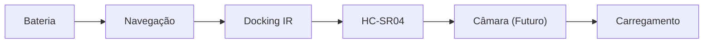

---

# Arquitetura Geral

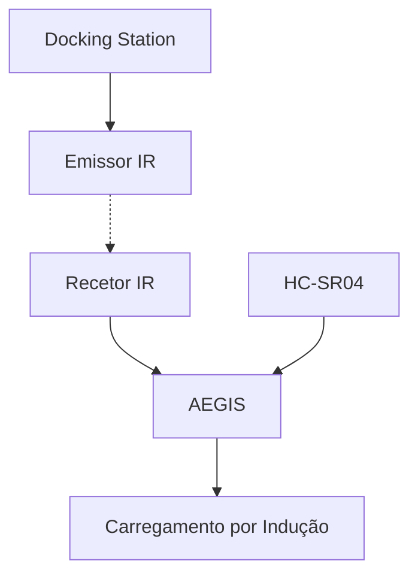

---

# Processo de Docking

O processo completo encontra-se dividido em várias fases.

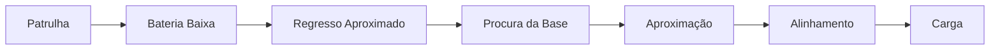

---

# Fase 1 - Deteção de Bateria Baixa

## Objetivo

Determinar quando interromper missões e iniciar o regresso.

---

## Critérios

Possíveis limiares:

| Estado | Valor |
|----------|----------|
| Aviso | < 30% |
| Retorno | < 25% |
| Crítico | < 15% |

Valores serão ajustados após testes.

---

# Fase 2 - Regresso Aproximado

## Sensores

### Atual

- MPU-6050

### Futuro

- Encoders

---

## Objetivo

Levar o robô para a área onde a base se encontra.

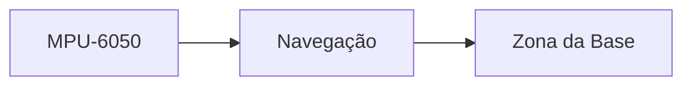

---

# Fase 3 - Procura da Base

## Tecnologia

Sinal infravermelho.

A estação de carga atua como farol.

---

## Componentes da Base

| Componente | Função |
|------------|------------|
| Emissor IR | Guiar o robô |
| Indicador LED | Diagnóstico |
| Módulo de alimentação | Alimentação da base |

---

## Estratégia

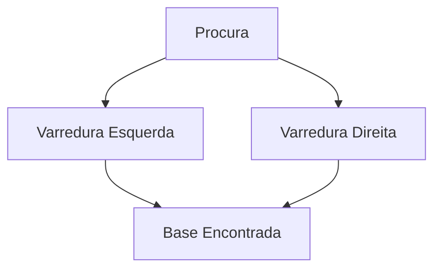

---

# Fase 4 - Aproximação

## Objetivo

Atingir a zona de acoplamento.

---

## Sensores

- Recetores IR

---

## Estratégia

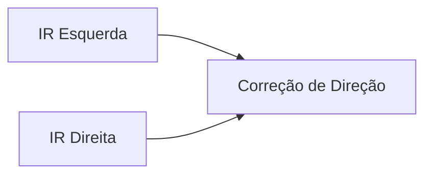

---

## Comportamento

| Situação | Ação |
|-----------|-----------|
| Sinais equilibrados | Avançar |
| Esquerda dominante | Corrigir esquerda |
| Direita dominante | Corrigir direita |

---

# Fase 5 - Alinhamento Final

## Objetivo

Posicionar o robô corretamente sobre a estação.

---

## Sensores

### Atual

- HC-SR04

### Futuro

- Câmara

---

## Fluxo

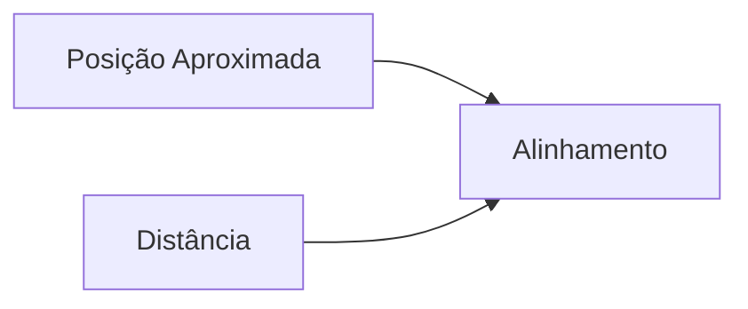

---

# Fase 6 - Início de Carga

## Objetivo

Confirmar que o carregamento começou com sucesso.

---

## Fluxo

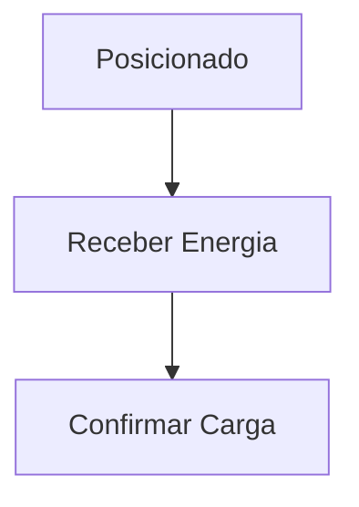

---

# Estação de Carga

## Arquitetura

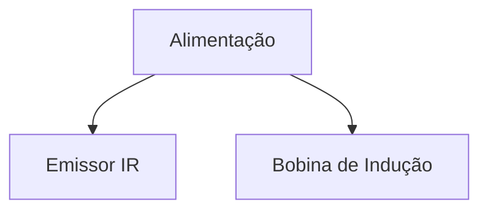

---

# Evolução Futura

## Encoders

Objetivo:

- melhorar odometria;
- melhorar regresso aproximado.

---

## Câmara

Objetivo:

- alinhamento visual;
- validação da posição da estação.

---

## Marcadores Visuais

Tecnologias possíveis:

- ArUco Marker
- QR Code
- Marcador personalizado

---

## Visão Computacional

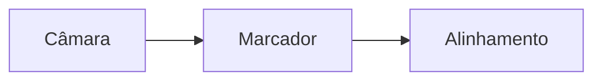

---

# Cenário Final

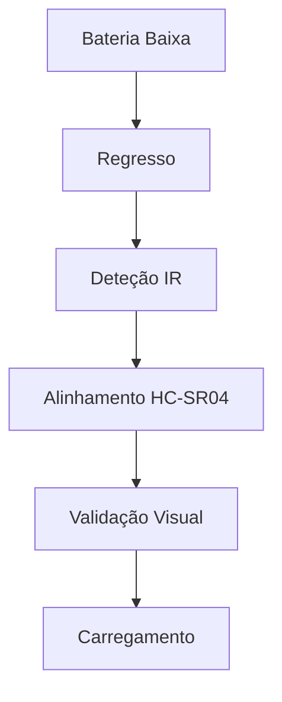

---

# Critérios de Sucesso

O sistema será considerado concluído quando:

- [ ] O robô identifica bateria baixa.
- [ ] O robô regressa autonomamente.
- [ ] A base é encontrada sem intervenção humana.
- [ ] O alinhamento é consistente.
- [ ] O carregamento inicia corretamente.
- [ ] O sistema funciona repetidamente e de forma fiável.

---

# Notas de Projeto

O sistema de docking do AEGIS inspira-se em soluções utilizadas por robôs domésticos autónomos, mas foi concebido para:

- utilizar sensores acessíveis;
- integrar-se com Home Assistant;
- evoluir modularmente;
- permitir melhorias futuras sem alterações estruturais profundas.

A arquitetura prevê desde o início a coexistência de:

- navegação inercial;
- navegação por IR;
- ultrassom;
- visão computacional.

Esta combinação deverá proporcionar elevada fiabilidade na localização da estação de carregamento.
``
