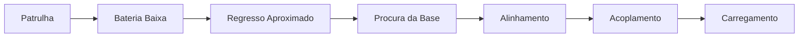
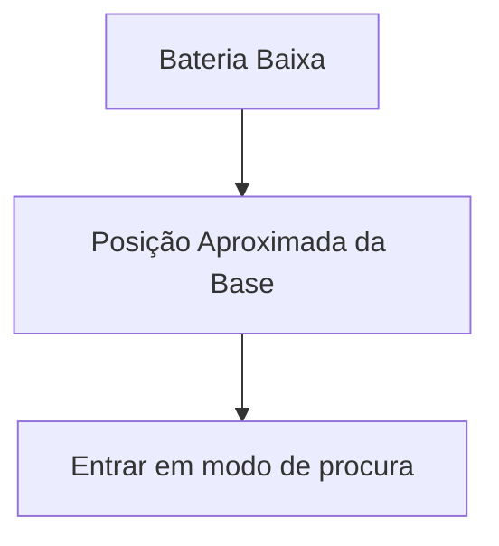
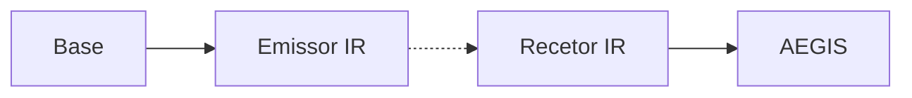
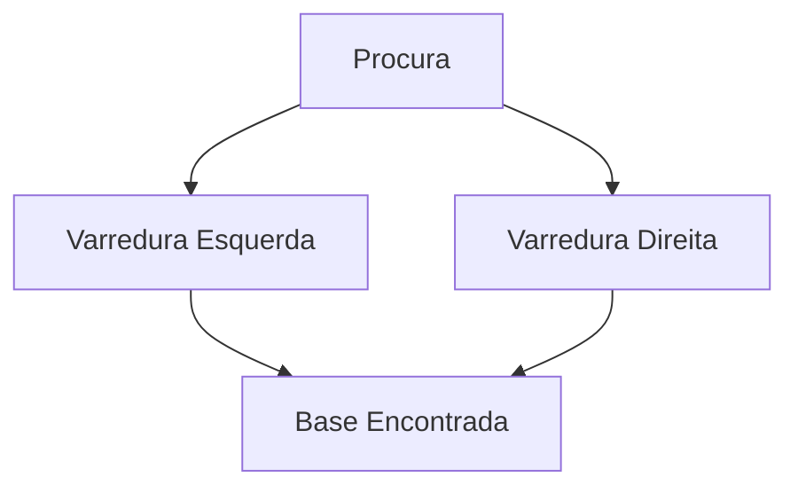
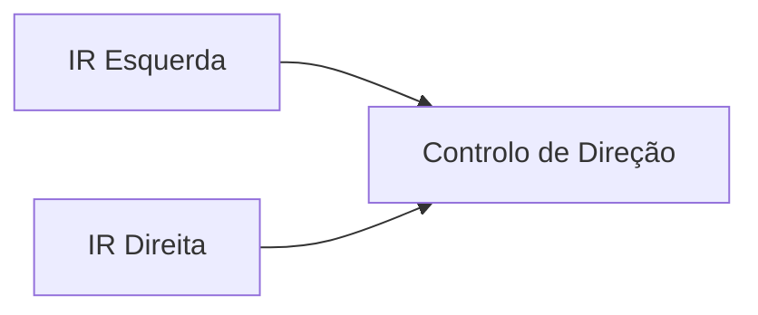
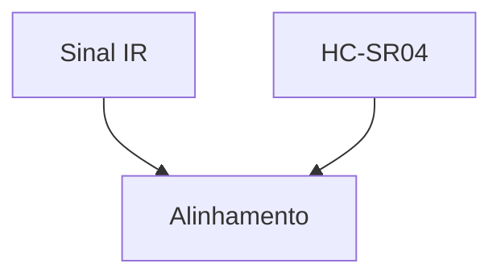
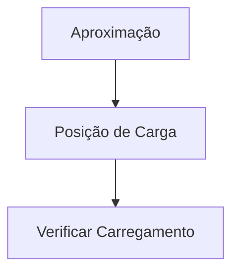
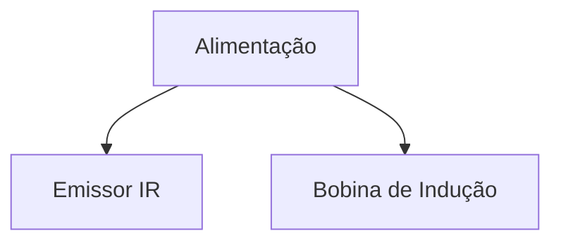
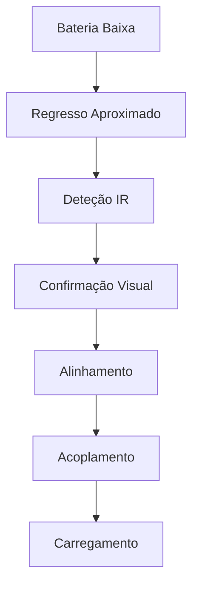

# Docking System

> AEGIS - Autonomous Docking Architecture

Versão: 1.0
Estado: Em desenvolvimento

---

# Objetivo

Permitir que o AEGIS:

- monitorize o seu estado energético
- determine quando deve regressar à base
- localize autonomamente a estação de carga
- execute o alinhamento final
- inicie o carregamento sem intervenção humana

O sistema deve permitir funcionamento contínuo da plataforma.

---

# Filosofia

O processo de docking será dividido em várias etapas independentes.

---

# Estratégia Geral

O sistema utiliza múltiplos sensores.

| Fase | Sensor Principal |
|--------|--------|
| Navegação geral | MPU-6050 |
| Navegação futura | Encoders |
| Localização da base | IR |
| Aproximação | IR |
| Distância final | HC-SR04 |
| Alinhamento futuro | Câmara |

---

# Fase 1 - Regresso Aproximado

## Objetivo

Levar o robô para a zona onde se encontra a estação.

---

## Sensores

### Atual

- MPU-6050

### Futuro

- Encoders

---

## Funcionamento

---

# Fase 2 - Procura da Base

## Objetivo

Detetar a estação de carregamento.

---

## Tecnologia

A estação emitirá um sinal infravermelho dedicado.

---

## Arquitetura

---

## Comportamento

Quando a base não é encontrada:

---

# Fase 3 - Aproximação

## Objetivo

Deslocar o robô até à estação.

---

## Sensores

- Recetores IR

---

## Estratégia

Comparação de intensidade de sinal.

---

## Regras

- sinal equilibrado → avançar
- sinal mais forte à esquerda → corrigir esquerda
- sinal mais forte à direita → corrigir direita

---

# Fase 4 - Alinhamento Final

## Objetivo

Garantir posicionamento correto sobre a estação.

---

## Sensores

### Atual

- HC-SR04

### Futuro

- Câmara
- Marcador visual

---

## Funcionamento

---

# Fase 5 - Acoplamento

## Objetivo

Posicionar corretamente a bobina de carga.

---

## Fluxo

---

# Estação de Carregamento

## Componentes Planeados

### Carregamento

- Bobina transmissora
- Alimentação

---

### Sinalização

- Emissor IR
- Indicadores LED

---

## Arquitetura

---

# Evolução Futura

## Encoders

Objetivo:

- aumentar precisão de navegação
- melhorar regresso aproximado

---

## Visão Artificial

Objetivo:

- reconhecimento visual da estação
- alinhamento preciso

---

## Marcador Visual

Possíveis soluções:

- QR Code
- ArUco Marker
- marcador proprietário

---

## Fluxo Futuro Completo

---

# Critérios de Sucesso

O sistema será considerado concluído quando:

- [ ] O robô identifica bateria baixa
- [ ] O robô inicia regresso à base
- [ ] O robô encontra a estação autonomamente
- [ ] O robô aproxima-se corretamente
- [ ] O robô inicia carregamento
- [ ] O robô confirma receção de energia
- [ ] O processo funciona sem intervenção humana

---

# Notas

A arquitetura de docking foi inspirada em sistemas de navegação utilizados em robôs domésticos autónomos.

O objetivo não é replicar exatamente um produto comercial, mas obter comportamento equivalente utilizando sensores de baixo custo, integração Home Assistant e uma arquitetura modular compatível com a evolução futura do AEGIS.
