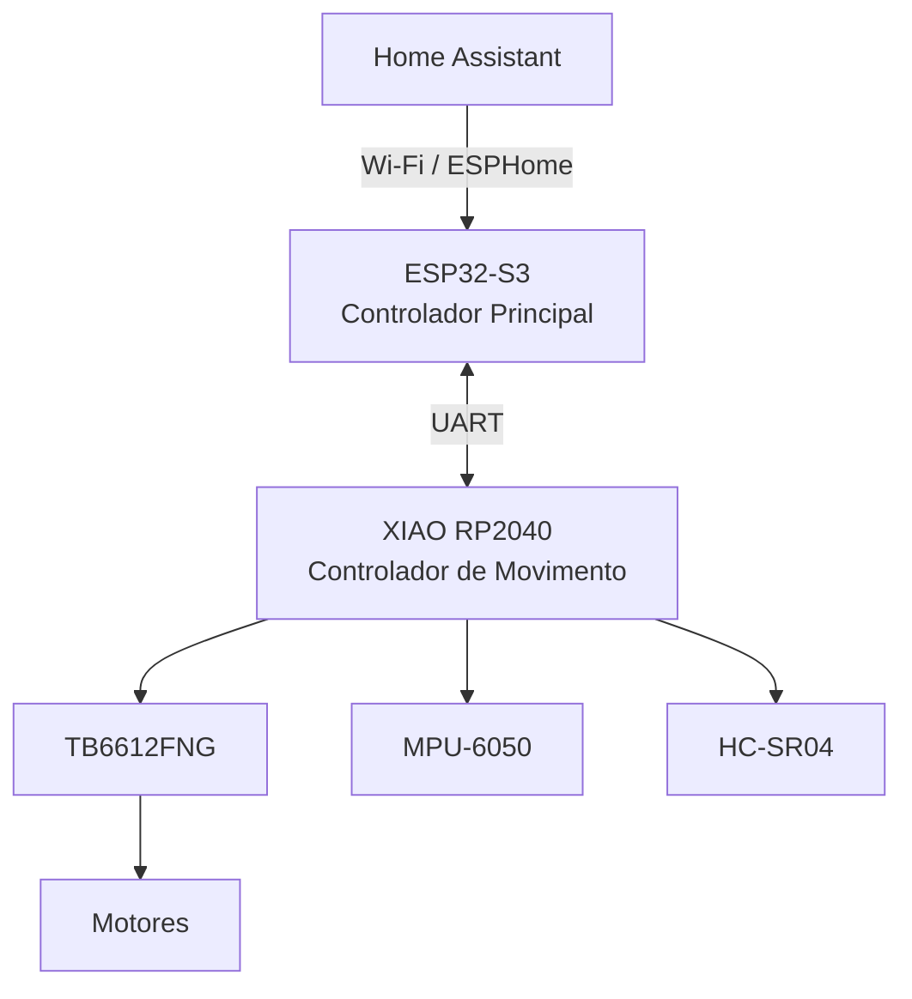

# AEGIS Architecture

> Autonomous Electronic Guardian Integrated System

Versão: 1.0 (Arquitetura Inicial)
Estado: Aprovada
Última atualização: 2026-09-01

---

# Visão Geral

O AEGIS é um robô autónomo de vigilância doméstica concebido para integração total com Home Assistant e ESPHome.

A arquitetura foi concebida segundo uma filosofia modular, separando:

- Movimento
- Perceção
- Inteligência
- Interação
- Energia

Esta abordagem reduz a complexidade do firmware e facilita a expansão futura.

---

# Arquitetura de Alto Nível

---

# Filosofia de Controlo

O AEGIS utiliza uma arquitetura de dois microcontroladores.

## RP2040

Responsável pelas tarefas de tempo real.

Vantagens:

- controlo determinístico
- resposta rápida
- isolamento
