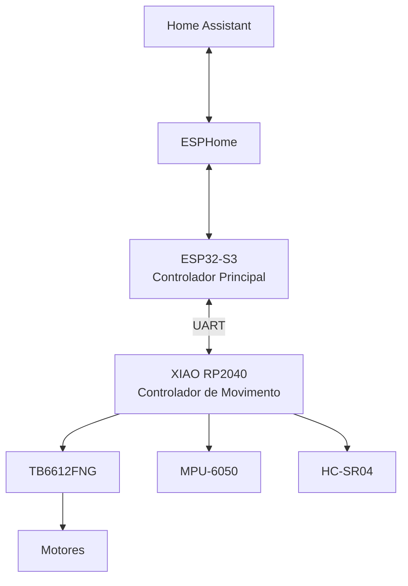

## Arquitetura Global

```mermaid
flowchart TD

    HA["Home Assistant"]
    ESPHOME["ESPHome"]

    ESP["ESP32-S3<br/>Controlador Principal"]

    RP["XIAO RP2040<br/>Controlador de Movimento"]

    HA <---> ESPHOME
    ESPHOME <---> ESP

    ESP <-->|UART| RP

    RP --> TB["TB6612FNG"]
    RP --> MPU["MPU-6050"]
    RP --> HCSR["HC-SR04"]

    TB --> MOTOR["Motores"]
```
