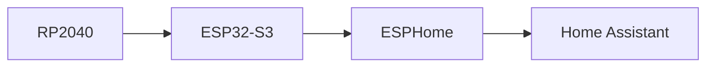
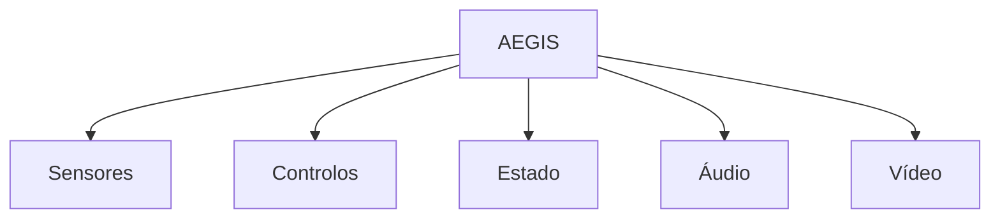
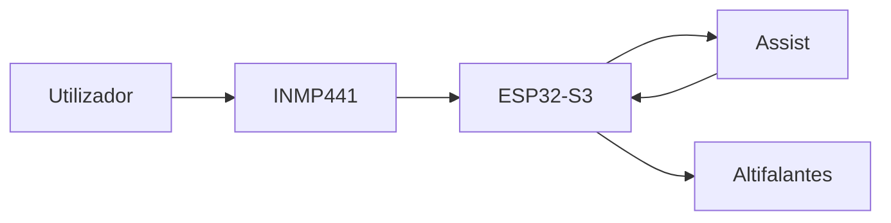

# ESPHome Design

> AEGIS - ESPHome Integration Architecture

Versão: 1.0
Estado: Arquitetura Definida

---

# Objetivo

Definir a integração do AEGIS com:

- ESPHome
- Home Assistant
- Assist

Este documento especifica:

- entidades;
- sensores;
- comandos;
- telemetria;
- serviços;
- automações futuras.

---

# Filosofia

O Home Assistant deve ver o AEGIS como uma entidade única.

A complexidade interna do robô permanece oculta.



---

# Entidade Principal

Nome:

```text
AEGIS
```

Identificador:

```text
aegis_home_guardian
```

Dispositivo:

```text
AEGIS Home Guardian
```

---

# Arquitetura de Entidades



---

# Sensores

## Bateria

```yaml
sensor:
  - platform: template
    name: "AEGIS Battery"
```

---

### Utilização

- dashboards
- automações
- docking

---

## Distância Frontal

```yaml
sensor:
  - platform: template
    name: "AEGIS Front Distance"
```

Fonte:

- HC-SR04

---

## Ângulo

```yaml
sensor:
  - platform: template
    name: "AEGIS Heading"
```

Fonte:

- MPU-6050

---

## Intensidade Sonora

```yaml
sensor:
  - platform: template
    name: "AEGIS Sound Level"
```

Fonte:

- INMP441

---

# Binary Sensors

## Obstáculo

```yaml
binary_sensor:
  - platform: template
    name: "AEGIS Obstacle"
```

---

## Carregamento

```yaml
binary_sensor:
  - platform: template
    name: "AEGIS Charging"
```

---

## Docked

```yaml
binary_sensor:
  - platform: template
    name: "AEGIS Docked"
```

---

## Ligação UART

```yaml
binary_sensor:
  - platform: template
    name: "AEGIS RP2040 Online"
```

---

# Text Sensors

## Estado Atual

```yaml
text_sensor:
  - platform: template
    name: "AEGIS State"
```

Valores previstos:

```text
IDLE
PATROL
MANUAL
DOCKING
CHARGING
ALERT
SAFE_MODE
```

---

## Último Evento

```yaml
text_sensor:
  - platform: template
    name: "AEGIS Last Event"
```

---

# Botões

## Patrulha

```yaml
button:
  - platform: template
    name: "Start Patrol"
```

---

## Parar

```yaml
button:
  - platform: template
    name: "Stop Patrol"
```

---

## Regressar à Base

```yaml
button:
  - platform: template
    name: "Return To Base"
```

---

## Reiniciar ESP32

```yaml
button:
  - platform: restart
```

---

# Switches

## Modo Patrulha

```yaml
switch:
  - platform: template
```

---

## Áudio

```yaml
switch:
  - platform: template
```

---

## Luz Ambiente

```yaml
switch:
  - platform: template
```

---

# Seletores

## Perfil de Operação

```yaml
select:
```

Opções:

```text
Patrulha
Manual
Noturno
Economia
Teste
```

---

# LEDs

## Estado da Iluminação

```yaml
light:
```

---

## Modos

```text
Patrol
Charging
Docking
Alert
Manual
```

---

# Câmara

## Entidade

```yaml
camera:
```

---

## Funcionalidades

- stream ao vivo;
- snapshot;
- gravação futura.

---

# Áudio

## Reprodução

```yaml
media_player:
```

---

Funções:

- alertas;
- TTS;
- anúncios.

---

# Assist

## Fluxo



---

# Diagnóstico

## Wi-Fi

```yaml
sensor:
```

Dados:

- RSSI
- uptime

---

## Firmware

```yaml
text_sensor:
```

Dados:

- versão
- build

---

## Telemetria

Dados:

- heartbeat RP2040
- watchdog
- estado UART

---

# Dashboard Principal

Objetivo:

Visualização rápida do estado do robô.

---

## Cartões

### Estado

- estado atual
- bateria
- carregamento

---

### Movimento

- velocidade
- direção
- distância frontal

---

### Sensores

- obstáculos
- orientação
- som

---

### Controlos

- iniciar patrulha
- parar
- regressar à base

---

### Vídeo

- imagem da câmara

---

# Automações Futuras

## Bateria Baixa

```text
Bateria Baixa
↓
Regressar à Base
```

---

## Modo Ausência

```text
Casa em Ausência
↓
Iniciar Patrulha
```

---

## Obstáculo Persistente

```text
Obstáculo
↓
Notificar
```

---

## Falha Crítica

```text
Failsafe
↓
Alerta
```

---

# Serviços Futuros

## Navegação

```text
patrol_start()
patrol_stop()
return_home()
dock()
```

---

## Diagnóstico

```text
self_test()
sensor_check()
```

---

# Critérios de Validação

A integração ESPHome será considerada concluída quando:

- [ ] O Home Assistant reconhece o AEGIS.
- [ ] A telemetria é recebida corretamente.
- [ ] Os comandos são executados.
- [ ] A câmara é apresentada.
- [ ] O áudio funciona.
- [ ] O Assist funciona.
- [ ] O docking pode ser iniciado remotamente.

---

# Princípio Fundamental

O Home Assistant deve ver o AEGIS como um único dispositivo inteligente.

Toda a complexidade interna:

- RP2040
- UART
- sensores
- firmware

deve permanecer transparente para o utilizador final.
