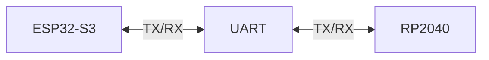

# Firmware Protocol

> AEGIS - RP2040 ↔ ESP32-S3 Communication Protocol

Versão: 1.0
Estado: Especificação Inicial

---

# Objetivo

Este documento define o protocolo de comunicação entre:

- RP2040
- ESP32-S3

A comunicação deverá permitir:

- envio de comandos;
- receção de telemetria;
- diagnóstico;
- deteção de falhas;
- evolução futura sem quebra de compatibilidade.

---

# Filosofia

O protocolo deve ser:

- simples;
- legível;
- facilmente depurável;
- independente do firmware.

Durante as fases iniciais será utilizado texto ASCII.

---

# Arquitetura



---

# Configuração UART

| Parâmetro | Valor |
|------------|------------|
| Velocidade | 115200 |
| Bits de Dados | 8 |
| Paridade | Nenhuma |
| Stop Bits | 1 |
| Controlo de Fluxo | Não |

Formato:

```text
8N1
```

---

# Estrutura das Mensagens

Formato geral:

```text
TIPO:CONTEUDO
```

Exemplos:

```text
CMD:MOVE_FORWARD
```

```text
TEL:BATTERY=85
```

```text
ERR:SONAR_TIMEOUT
```

---

# Tipos de Mensagem

| Prefixo | Descrição |
|----------|----------|
| CMD | Comandos |
| TEL | Telemetria |
| ACK | Confirmação |
| ERR | Erro |
| DBG | Diagnóstico |

---

# Comandos de Movimento

## Frente

```text
CMD:MOVE_FORWARD
```

---

## Trás

```text
CMD:MOVE_BACKWARD
```

---

## Esquerda

```text
CMD:TURN_LEFT
```

---

## Direita

```text
CMD:TURN_RIGHT
```

---

## Parar

```text
CMD:STOP
```

---

# Comandos de Navegação

## Patrulha

```text
CMD:PATROL
```

---

## Docking

```text
CMD:DOCK
```

---

## Regresso à Base

```text
CMD:RETURN_HOME
```

---

# Comandos de Sistema

## Ativar Motores

```text
CMD:ENABLE_MOTORS
```

---

## Desativar Motores

```text
CMD:DISABLE_MOTORS
```

---

## Reinício

```text
CMD:RESET
```

---

# Telemetria

## Distância

```text
TEL:DISTANCE=124
```

Unidade:

```text
cm
```

---

## Ângulo

```text
TEL:ANGLE=45
```

Unidade:

```text
graus
```

---

## Bateria

```text
TEL:BATTERY=83
```

Unidade:

```text
%
```

---

## Estado

```text
TEL:STATE=PATROL
```

---

## Obstáculo

```text
TEL:OBSTACLE=TRUE
```

---

## Carregamento

```text
TEL:CHARGING=TRUE
```

---

# Respostas ACK

## Sucesso

```text
ACK:MOVE_FORWARD
```

---

## Falha

```text
ERR:MOVE_FORWARD
```

---

# Tipos de Erro

## Sensor

```text
ERR:SONAR_TIMEOUT
```

```text
ERR:IMU_FAILURE
```

---

## Comunicação

```text
ERR:UART_TIMEOUT
```

```text
ERR:INVALID_COMMAND
```

---

## Energia

```text
ERR:LOW_BATTERY
```

---

# Mensagens de Debug

## Informação

```text
DBG:STARTUP_COMPLETE
```

---

## Modo Docking

```text
DBG:DOCKING_STARTED
```

---

## Patrulha

```text
DBG:PATROL_STARTED
```

---

# Máquina de Estados

```mermaid
stateDiagram-v2

    [*] --> IDLE

*   IDLE --> MANUAL

    IDLE --> P*TROL

    PATROL --> DOCKING

    *OCKING --> CHARGING

    CHARGING *-> IDLE

   *MAN*AL --> IDLE
```

---

# Heartbeat
*## Objetivo

Confirmar que ambos o* controladores continuam ativos.

*--

## Mensagem

```text
TEL:HEART*EAT
```

---

## Frequência

```te*t
1 segundo
```

---

# Timeout

#* RP2040

Se não receber comandos v*lidos num intervalo definido:

```*ext
Parar movimento
```

---

## E*P32-S3

Se não receber heartbeat:
*```text
Assinalar comunicação perd*da
```

---

# Evolução Futura

##*Estrutura JSON

Versão futura poss*vel:

```json
{
  "type": "telemet*y",
  "sensor": "battery",
  "valu*": 84
}
```

---

## Vantagens

- *ais flexível;
- mais extensível;
-*compatível com MQTT;
- fácil integ*ação com Home Assistant.

---

# C*mpatibilidade

A versão inicial do*protocolo deverá permanecer suport*da mesmo após introdução de format*s mais avançados.

---

# Regras

*# Regra 1

Todas as mensagens term*nam com:

```text
\\n
```

---

##*Regra 2

Todas as mensagens utiliz*m ASCII.

---

## Regra 3

Nenhuma*mensagem pode exceder:

```text
12* caracteres
```

---

##*Regra 4

Comandos desconhe*idos devem gerar:

```text
ERR:INV*LID_COMMAND
```

*--

# Critérios de Validação

O pr*tocolo será*considerado validado quando:

- [*] Comandos são recebidos corretame*te.
-*[ * Telemetria é recebida corretament*.
- [ ] ACK funciona corretamente.*- [ ] Heartbeat funciona corretame*te.
- [ ] Timeout é tratado corret*mente.
- [ * O sistema recupera após rein*cio de qualquer*controlador.

---

# Princípio Fun*amental

A comunicação deve*permanecer simples.

*empre que houver dúvida entre:

- *implicidade;
- sofisticação;

**simplicidade deve prevalecer.

Um *rotocolo fácil de diagnosticar é m*is valioso do que um protocolo com*lexo com mais funcionalidades.
```*
