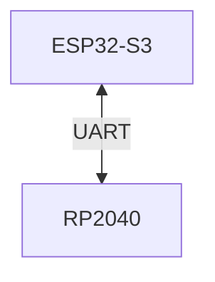
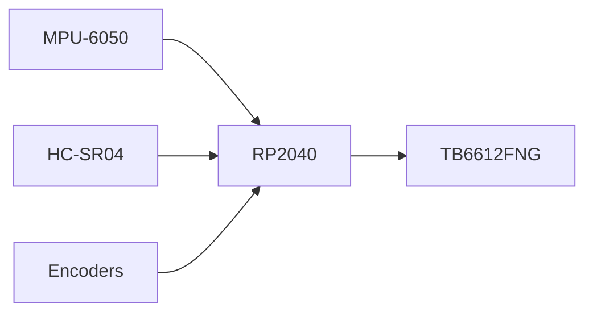
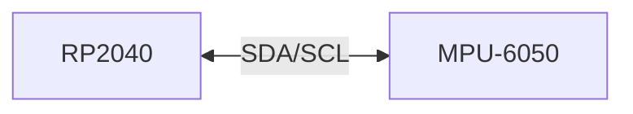
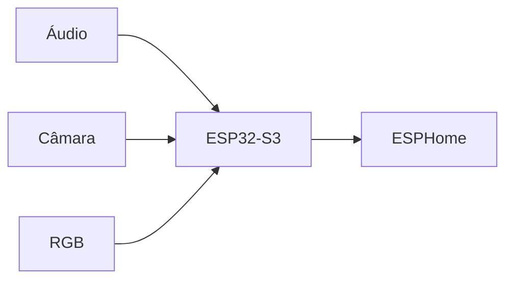
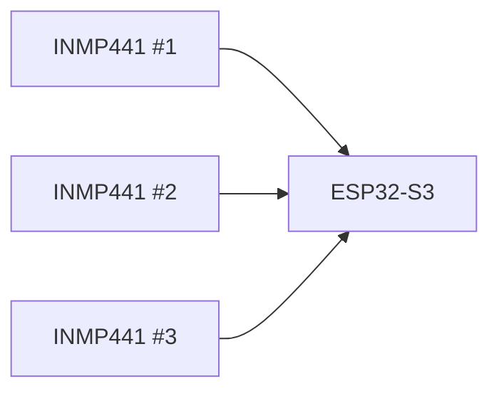

# GPIO Allocation

> AEGIS - Pin Planning and Allocation

Versão: 1.0
Estado: Planeamento Inicial

---

# Objetivo

Este documento define a utilização prevista dos GPIOs do sistema.

Os pinos aqui indicados representam uma reserva lógica de recursos.

A atribuição definitiva apenas será confirmada após os testes físicos.

---

# Filosofia

A arquitetura AEGIS divide funções por dois controladores:

- RP2040 → movimento e sensores de navegação
- ESP32-S3 → áudio, vídeo, comunicações e coordenação

---

# Arquitetura Geral

---

# XIAO RP2040

## Funções Principais

---

## Reserva de GPIOs

| GPIO | Função | Estado |
|--------|--------|--------|
| GP0 | UART TX → ESP32-S3 | Reservado |
| GP1 | UART RX ← ESP32-S3 | Reservado |
| GP2 | TB6612FNG PWM A | Reservado |
| GP3 | TB6612FNG PWM B | Reservado |
| GP4 | TB6612FNG IN1 | Reservado |
| GP5 | TB6612FNG IN2 | Reservado |
| GP6 | TB6612FNG IN3 | Reservado |
| GP7 | TB6612FNG IN4 | Reservado |
| GP8 | HC-SR04 TRIG | Reservado |
| GP9 | HC-SR04 ECHO | Reservado |
| GP10 | Servo PWM | Reservado |
| GP11 | Encoder A | Futuro |
| GP12 | Encoder B | Futuro |
| GP13 | Encoder C | Futuro |
| GP14 | Encoder D | Futuro |
| GP16 | SDA | Reservado |
| GP17 | SCL | Reservado |

---

## Barramento I²C

---

# ESP32-S3

## Funções Principais

---

## Reserva de GPIOs

| GPIO | Função | Estado |
|--------|--------|--------|
| GPIO1 | UART RX ← RP2040 | Reservado |
| GPIO2 | UART TX → RP2040 | Reservado |
| GPIO3 | LED RGB #1 | Reservado |
| GPIO4 | LED RGB #2 | Reservado |
| GPIO5 | LED RGB #3 | Reservado |
| GPIO6 | LED RGB #4 | Reservado |
| GPIO7 | LED RGB #5 | Reservado |
| GPIO8 | PAM8302 #1 | Reservado |
| GPIO9 | PAM8302 #2 | Reservado |
| GPIO10 | INMP441 WS | Reservado |
| GPIO11 | INMP441 SCK | Reservado |
| GPIO12 | INMP441 SD | Reservado |
| GPIO13 | Câmara | Reservado |
| GPIO14 | Câmara | Reservado |
| GPIO15 | Câmara | Reservado |

---

## Entradas de Áudio

---

# GPIOs Reservados para Futuras Expansões

## RP2040

| GPIO | Utilização Prevista |
|--------|--------|
| GP18 | Sensor futuro |
| GP19 | Sensor futuro |
| GP20 | Sensor de docking |
| GP21 | Sensor de docking |

---

## ESP32-S3

| GPIO | Utilização Prevista |
|--------|--------|
| GPIO16 | Sensor futuro |
| GPIO17 | Sensor futuro |
| GPIO18 | Sensor futuro |
| GPIO21 | Sensor futuro |

---

# Regras do Projeto

## Regra 1

Nunca reutilizar um GPIO reservado sem atualizar este documento.

---

## Regra 2

Qualquer alteração deve ser registada também em:

- project_state.md
- architecture.md

quando aplicável.

---

## Regra 3

Durante a fase de protótipo:

- a documentação tem prioridade sobre o código
- alterações de pinagem devem ser registadas imediatamente

---

# Estado Atual

Atribuição preliminar.

Nenhum GPIO está ainda considerado definitivo.

A reserva atual existe apenas para evitar conflitos à medida que o hardware é integrado.
