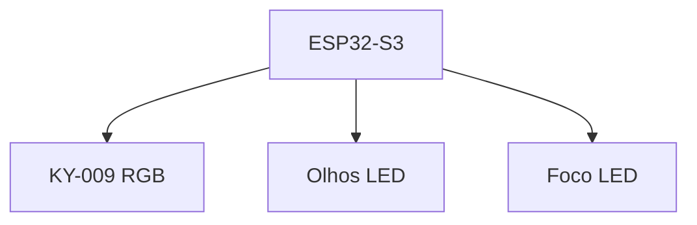
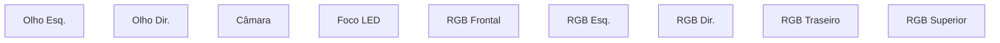
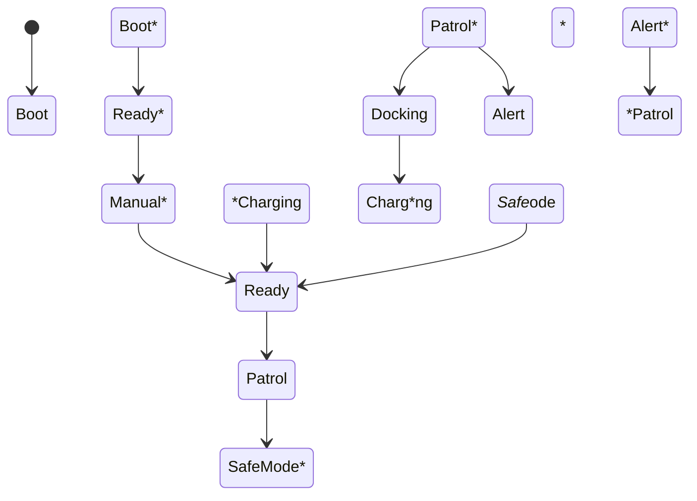

# LED System

> AEGIS - Visual Status and Lighting Architecture

Versão: 1.0
Estado: Arquitetura Definida

---

# Objetivo

O sistema de iluminação do AEGIS tem como função:

- indicar estados do robô;
- fornecer feedback visual;
- melhorar a interação com o utilizador;
- aumentar a visibilidade;
- apoiar operações de vigilância.

---

# Filosofia

Os LEDs não são decoração.

Cada padrão luminoso deve transmitir informação útil.

Objetivos:

- diagnóstico rápido;
- identificação de estados;
- apoio a operação autónoma;
- experiência de utilização.

---

# Arquitetura Geral



---

# Subsistemas

## Iluminação Ambiental

Componentes:

- KY-009 RGB ×5

Funções:

- indicação de estado;
- iluminação da saia translúcida;
- efeitos visuais.

---

## Olhos LED

Componentes:

- LEDs frontais

Funções:

- personalidade visual;
- indicação rápida de estado;
- reconhecimento visual do robô.

---

## Foco LED

Componentes:

- foco frontal

Funções:

- iluminação da câmara;
- inspeção visual;
- apoio à vigilância.

---

# Arquitetura Física



---

# Estados do Sistema

## Arranque

Cor:

```text
Azul
```

Efeito:

```text
Respiração lenta
```

Objetivo:

- indicar inicialização.

---

## Pronto

Cor:

```text
Verde
```

Efeito:

```text
Fixo
```

Objetivo:

- sistema operacional.

---

## Patrulha

Cor:

```text
Azul
```

Efeito:

```text
Suave
```

Objetivo:

- indicar operação autónoma.

---

## Modo Manual

Cor:

```text
Roxo
```

Efeito:

```text
Fixo
```

Objetivo:

- utilizador está a controlar o robô.

---

## Procura da Base

Cor:

```text
Amarelo
```

Efeito:

```text
Piscar lento
```

Objetivo:

- indicar docking em curso.

---

## Carregamento

Cor:

```text
Verde
```

Efeito:

```text
Pulsação
```

Objetivo:

- indicar carga ativa.

---

## Bateria Baixa

Cor:

```text
Laranja
```

Efeito:

```text
Piscar lento
```

Objetivo:

- alerta energético.

---

## Alerta

Cor:

```text
Vermelho
```

Efeito:

```text
Piscar rápido
```

Objetivo:

- evento importante.

---

## Falha Crítica

Cor:

```text
Vermelho
```

Efeito:

```text
Piscar contínuo
```

Objetivo:

- indicar estado inseguro.

---

## Safe Mode

Cor:

```text
Vermelho + Azul
```

Efeito:

```text
Alternado
```

Objetivo:

- identificar modo de recuperação.

---

# Máquina de Estados



*--

# Saia Translúcida

## Objetiv*

Difundir a iluminação RGB.

---
**# Resultado Esperado

```text**EDs*ocultos
+
*if*são uniforme
+
*sp*to profissional
```

*--

#*Integração Home Assistant

*# Entidade Principal

```yaml*light:
  -*platform:*rgb
```

*--

##*Controlo

Perm*tir*

- ativ*r/desativar;
* alterar brilho;
- alterar*cor;
- executar*efeitos*

---

* Modos Autom*ticos

## Patrulha

```text**atrol
*
Azul
```

*--

## Dock*ng

```text
Docking
↓
*m*relo
```

*--

## Charging*
```text
Charging
↓
Verde**``

---

## Alert

```text**lert
↓
Vermelho
```

*--

* Olhos LED

## Modo Normal

```tex*
Azul Suave
```

*--

## Esc*ta

```text
Ciano
```

*--

## Processamento

```text*Br*nco
```

---

## Resposta

```*ext
Verde
```

*--

## Erro

*``text
Vermelho
```

*--

# Foco LED

## Utilizações

##**Vigilância

Ativado*
