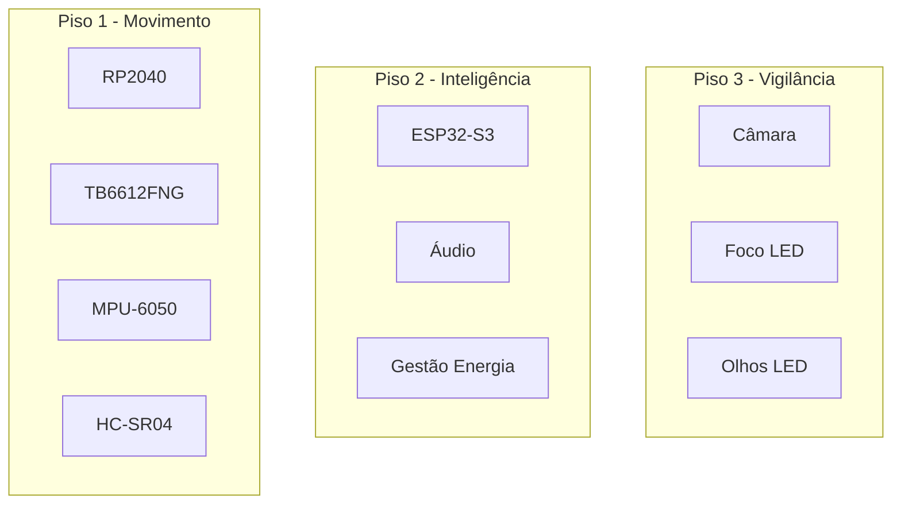
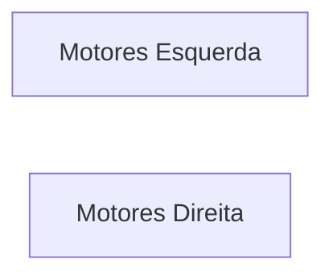
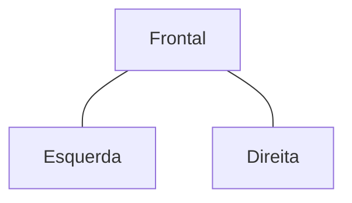
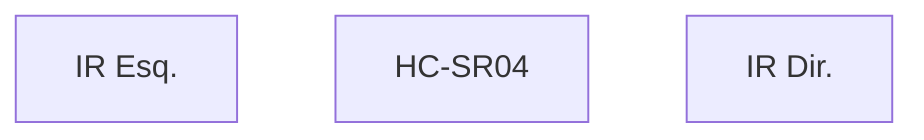

# Mechanical Design

> AEGIS - Mechanical Architecture and Construction

Versão: 1.0
Estado: Arquitetura Definida

---

# Objetivo

Este documento descreve a arquitetura mecânica do AEGIS.

Inclui:

- estrutura principal;
- organização por pisos;
- sistema de rodas;
- suporte dos sensores;
- acesso para manutenção;
- expansões futuras.

---

# Filosofia

O AEGIS foi concebido segundo quatro princípios:

- modularidade;
- manutenção simples;
- estabilidade;
- capacidade de evolução.

A estrutura deve permitir substituir módulos sem reconstruir o robô.

---

# Arquitetura Geral



---

# Chassis

## Estrutura Principal

Tipo:

```text
Circular
```

Construção:

```text
Acrílico
```

Objetivos:

- baixo peso;
- facilidade de corte;
- facilidade de modificação;
- custo reduzido.

---

# Organização por Pisos

## Piso 1

Responsável por:

- movimento;
- sensores de navegação.

Componentes:

- RP2040;
- TB6612FNG;
- MPU-6050;
- HC-SR04.

---

## Piso 2

Responsável por:

- coordenação;
- comunicações;
- áudio;
- energia.

Componentes:

- ESP32-S3;
- INMP441;
- PAM8302;
- Powerbank.

---

## Piso 3

Responsável por:

- vídeo;
- iluminação frontal;
- interação visual.

Componentes:

- Câmara;
- Foco LED;
- Olhos LED.

---

# Sistema de Rodas

## Configuração

```text
4 rodas
```

---

## Objetivo

- estabilidade;
- distribuição uniforme do peso;
- futura integração de encoders.

---

## Vista Conceptual

```text

        Frente

      O       O


      O       O

       Traseira
```

---

# Motores

## Quantidade

```text
4
```

---

## Distribuição



---

# Centro de Gravidade

## Objetivo

Manter o centro de massa o mais baixo possível.

---

## Componentes Pesados

Devem ficar preferencialmente:

- no Piso 1;
- no Piso 2;
- próximos do centro.

---

## Componentes Críticos

### Powerbank

Posição preferencial:

```text
Centro inferior
```

---

### MPU-6050

Posição preferencial:

```text
Centro geométrico
```

---

# Sistema de Áudio

## Microfones

Distribuição triangular.



Objetivos:

- melhor cobertura;
- futura localização sonora.

---

# Sistema de Visão

## Câmara

Posição:

```text
Centro frontal superior
```

---

## Foco LED

Posição:

```text
Abaixo da câmara
```

---

## Olhos LED

Posição:

```text
Laterais da câmara
```

---

# Saia Translúcida

## Objetivos

- esconder cablagem;
- proteger eletrónica;
- difundir iluminação RGB.

---

## Cobertura

Pisos:

```text
1 + 2
```

---

## Requisitos

- removível;
- resistente;
- manutenção simples.

---

# Fixação da Saia

## Soluções Avaliadas

### Magnética

Vantagens:

- montagem rápida;
- manutenção simples.

---

### Encaixe Mecânico

Vantagens:

- maior robustez.

---

## Decisão

Estado:

```text
Em avaliação
```

---

# Sistema de Docking

## Considerações Mecânicas

A frente do robô deverá permitir:

- deteção IR;
- utilização do HC-SR04;
- futura navegação visual.

---

## Região Frontal



---

# Cablagem

## Filosofia

A cablagem deverá ser organizada por subsistemas:

- movimento;
- energia;
- áudio;
- vídeo.

---

## Objetivos

- manutenção simples;
- diagnóstico rápido;
- modularidade.

---

# Manutenção

## Acesso Frequente

- powerbank;
- ESP32-S3;
- RP2040.

---

## Acesso Médio

- PAM8302;
- ligações UART.

---

## Acesso Raro

- motores;
- indução.

---

# Expansões Futuras

Espaço reservado para:

- encoders;
- sensores IR de docking;
- painel solar;
- sensores ambientais;
- módulos adicionais.

---

# Roadmap Mecânico

## Versão 1

- Chassis base;
- Movimento;
- Navegação.

---

## Versão 2

- Docking;
- Saia translúcida.

---

## Versão 3

- Câmara;
- Áudio.

---

## Versão 4

- Energia solar.

---

# Critérios de Validação

A estrutura mecânica será considerada validada quando:

- [ ] Todos os componentes estão montados.
- [ ] O centro de gravidade é estável.
- [ ] A manutenção é simples.
- [ ] Não existem interferências mecânicas.
- [ ] A cablagem encontra-se organizada.
- [ ] A saia pode ser removida facilmente.

---

# Princípios de Projeto

O design mecânico do AEGIS segue uma hierarquia simples:

```text
Movimento
↓
Energia
↓
Inteligência
↓
Perceção
```

A estabilidade e a manutenção têm prioridade sobre a estética.

Qualquer alteração estrutural deverá atualizar:

- architecture.md
- physical-layout.md
- mechanical-design.md
