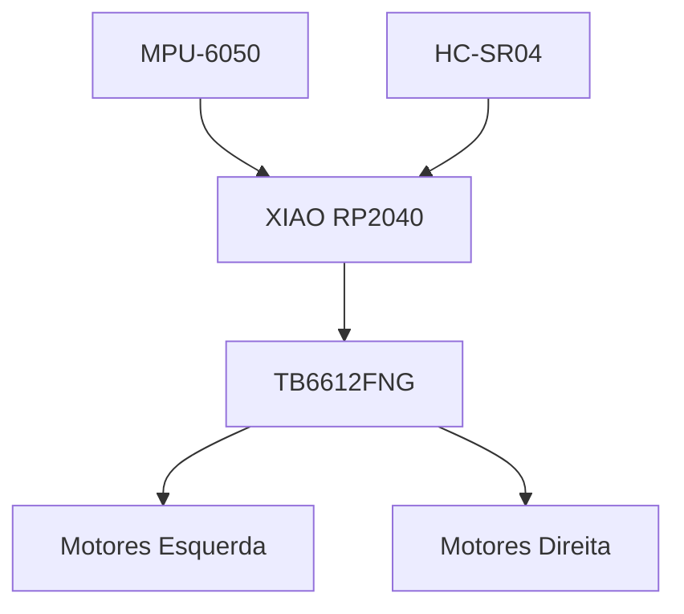
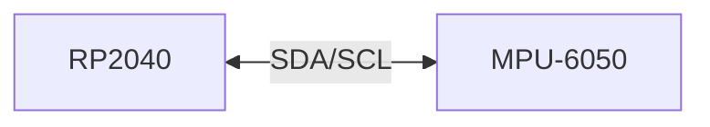
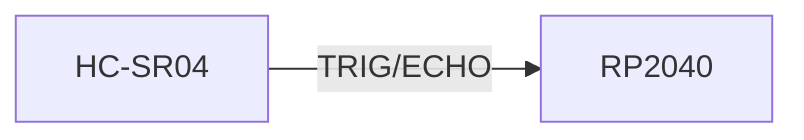
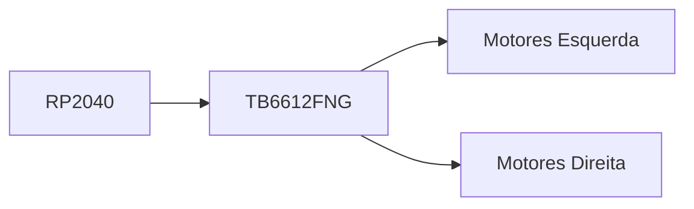
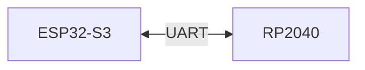

# Motor Platform

> AEGIS - Motion Control Subsystem

Versão: 1.0
Estado: Em desenvolvimento

---

# Objetivo

Construir e validar a primeira plataforma funcional do AEGIS.

Esta fase deve permitir:

- deslocação para a frente
- deslocação para trás
- rotação
- paragem controlada
- deteção de obstáculos
- monitorização da orientação

Esta plataforma deverá funcionar independentemente do ESP32-S3.

---

# Arquitetura



---

# Componentes

## Controlador

- Seeed XIAO RP2040

Funções:

- controlo dos motores
- leitura dos sensores
- lógica de navegação local
- comunicação UART

---

## Driver de Motores

- TB6612FNG

Funções:

- controlo PWM
- controlo de direção

Substitui:

- L298N

Motivação:

- maior eficiência
- menor aquecimento
- menor consumo energético

---

## IMU

- MPU-6050

Funções:

- orientação
- aceleração
- rotação

Utilização inicial:

- medição de ângulo
- ajuda na rotação controlada

---

## Sensor Ultrassónico

- HC-SR04

Posição:

- Frente do robô

Funções:

- evitar obstáculos
- reduzir velocidade
- auxiliar docking futuro

---

# Ligações Lógicas

## Barramento I²C



---

## Ultrassónico



---

## Driver de Motores



---

# Firmware Inicial

## Funções Obrigatórias

- Inicializar TB6612FNG
- Inicializar MPU-6050
- Inicializar HC-SR04
- Controlo básico dos motores
- Rotação controlada
- Leitura de distância

---

## Comandos de Teste

```text
F
Frente

B
Trás

L
Esquerda

R
Direita

S
Stop
```

---

# Critérios de Sucesso

A plataforma motora será considerada concluída quando:

- [ ] O robô se desloca para a frente
- [ ] O robô se desloca para trás
- [ ] O robô roda à esquerda
- [ ] O robô roda à direita
- [ ] O robô pára corretamente
- [ ] O HC-SR04 mede distância
- [ ] O MPU-6050 produz dados estáveis

---

# Evoluções Futuras

## Encoders

Objetivo:

- odometria
- medição de distância percorrida

---

## PID

Objetivo:

- manter trajetória reta
- melhorar precisão das curvas

---

## UART

Objetivo:

Comunicação com o ESP32-S3.



---

# Notas

Esta plataforma deve permanecer operacional mesmo sem:

- ESP32-S3
- Home Assistant
- ESPHome
- Câmara
- Áudio

Todos os subsistemas futuros dependerão desta plataforma.
A estabilidade da camada motora tem prioridade sobre novas funcionalidades.
