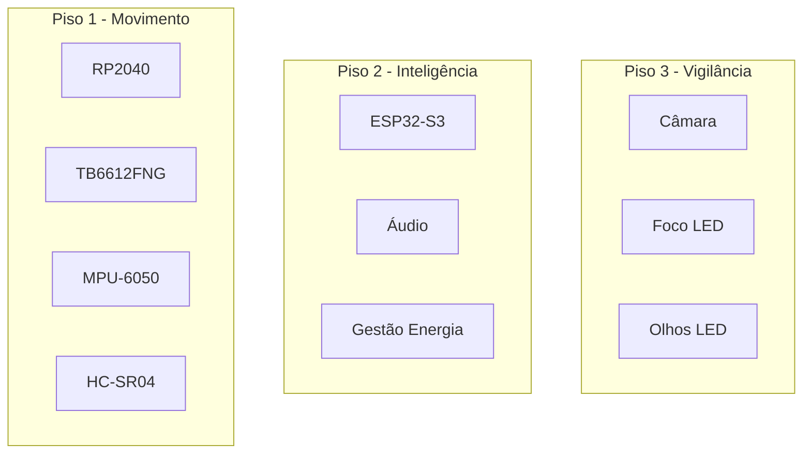
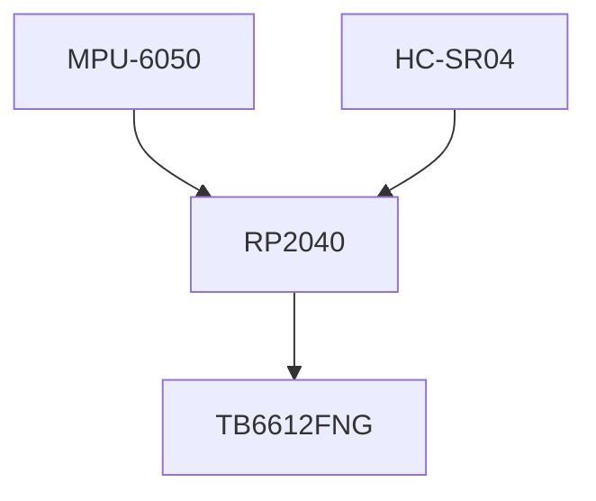
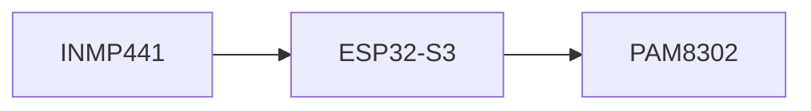
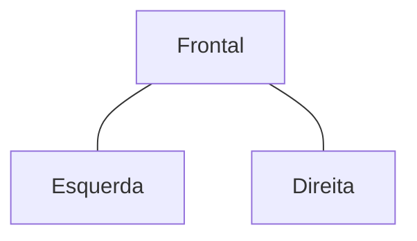
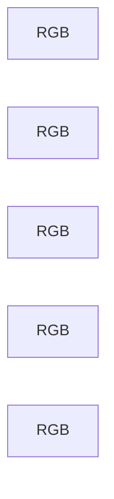
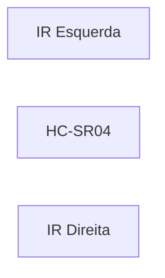
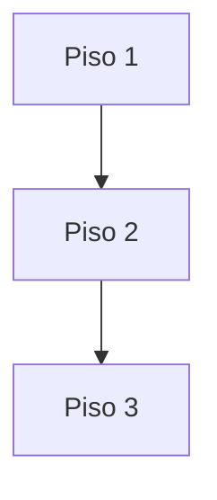

# Physical Layout

> AEGIS - Physical Architecture and Component Placement

Versão: 1.0
Estado: Arquitetura Definida

---

# Objetivo

Este documento descreve a organização física do AEGIS.

Define:

- distribuição dos componentes;
- estrutura por pisos;
- posicionamento dos sensores;
- zonas de manutenção;
- passagem de cablagem;
- espaço reservado para expansões futuras.

---

# Filosofia

O AEGIS foi concebido segundo uma arquitetura modular.

Cada piso possui uma responsabilidade específica:

| Piso | Função |
|--------|--------|
| Piso 1 | Movimento |
| Piso 2 | Inteligência |
| Piso 3 | Vigilância e Interação |

Esta abordagem permite:

- montagem faseada;
- manutenção simplificada;
- expansão futura;
- substituição de módulos.

---

# Vista Geral



---

# Piso 1 - Movimento

## Objetivo

Controlo da locomoção.

---

## Componentes



---

## Posicionamento

### Frente

- HC-SR04

### Centro

- RP2040
- TB6612FNG

### Centro geométrico

- MPU-6050

---

## Justificação

O MPU-6050 deverá ficar o mais próximo possível do centro do robô para reduzir erros causados por vibrações e rotações.

---

# Piso 2 - Inteligência

## Objetivo

Executar:

- ESPHome
- comunicação
- áudio
- coordenação geral

---

## Componentes



---

## Posicionamento

### Centro

- ESP32-S3

### Periferia

- Microfones

### Laterais

- Amplificadores

---

# Piso 3 - Vigilância

## Objetivo

Sistema visual e interação.

---

## Componentes


---

## Posicionamento

### Frente

- Câmara

### Lados da câmara

- Olhos LED

### Inferior

- Foco LED

---

## Representação Conceptual

```text
      Olho      Olho

         Câmara

          Foco
```

---

# Sistema de Áudio

## Disposição dos Microfones



---

## Objetivos

- cobertura sonora uniforme;
- localização aproximada da origem do som;
- redução de zonas mortas.

---

# Sistema de Iluminação

## RGB Ambiental

Os LEDs RGB devem iluminar a estrutura de forma indireta.

---

## Posição Prevista



Distribuição:

- frente;
- traseira;
- laterais.

---

# Saia Translúcida

## Objetivo

- ocultar cablagem;
- proteger componentes;
- difundir iluminação RGB;
- melhorar acabamento visual.

---

## Cobertura

A saia deverá envolver:

- Piso 1
- Piso 2

até aproximadamente ao nível dos eixos das rodas.

---

## Aberturas Previstas

### Obrigatórias

- HC-SR04

---

### Possíveis

- Microfones
- Altifalantes
- Sensores IR de docking

---

# Sistema de Energia

## Componentes


---

## Posicionamento

### Centro Inferior

- Powerbank

### Próximo da base

- Receptor de indução

### Piso superior (futuro)

- Painel solar

---

# Sistema de Docking

## Sensores

### Atual

- HC-SR04

### Futuro

- IR
- Câmara

---

## Posição Prevista



---

# Cablagem

## Princípios

- cabos separados por subsistema;
- evitar passagem sobre motores;
- minimizar cruzamentos;
- facilitar desmontagem.

---

## Percurso Principal



---

# Zonas de Manutenção

## Acesso Frequente

- Powerbank
- ESP32-S3
- RP2040

---

## Acesso Ocasional

- PAM8302
- Cablagem

---

## Acesso Raro

- Motores
- Sistema de indução

---

# Espaço Reservado

## Futuras Expansões

- Encoders
- Marcadores visuais
- Sensores ambientais
- Monitorização energética
- Módulos adicionais de comunicação

---

# Critérios de Validação

A arquitetura física será considerada validada quando:

- [ ] Todos os componentes cabem sem interferências mecânicas.
- [ ] A manutenção é possível sem desmontagem total.
- [ ] O centro de gravidade permanece estável.
- [ ] Não existem conflitos entre sensores.
- [ ] A cablagem é organizada e acessível.
- [ ] A saia translúcida pode ser removida facilmente.

---

# Notas de Projeto

A organização física do AEGIS segue o princípio:

- movimento em baixo;
- inteligência ao centro;
- perceção no topo.

Esta distribuição melhora:

- estabilidade;
- manutenção;
- modularidade;
- capacidade de evolução futura.

Qualquer alteração estrutural deverá atualizar este documento antes de ser implementada no hardware.
