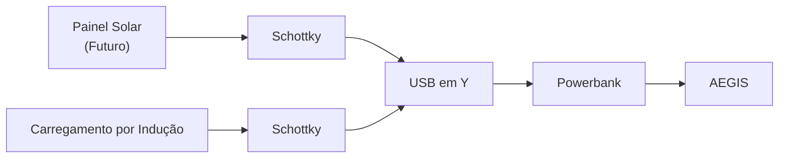

# Power Budget

> AEGIS - Energy Consumption and Power Analysis

Versão: 1.0
Estado: Planeamento Inicial

---

# Objetivo

Este documento define a estratégia de análise energética do AEGIS.

Tem como objetivos:

- identificar os consumidores de energia;
- medir consumos reais;
- calcular autonomia;
- otimizar utilização da bateria;
- validar futuras integrações solares.

---

# Filosofia

Todas as decisões energéticas devem basear-se em medições reais.

Não devem ser assumidos valores teóricos sem validação experimental.

---

# Arquitetura Energética



---

# Fontes de Energia

## Principal

| Fonte | Função |
|---------|---------|
| Powerbank | Alimentação principal |

---

## Complementares

| Fonte | Função |
|---------|---------|
| Carregamento por indução | Recarga automática |
| Painel solar | Apoio energético futuro |

---

# Consumidores de Energia

## Movimento

| Componente | Qt. | Medição |
|------------|------|----------|
| Motores DC | 4 | Pendente |
| TB6612FNG | 1 | Pendente |
| Servo | 1 | Pendente |

---

## Controladores

| Componente | Qt. | Medição |
|------------|------|----------|
| XIAO RP2040 | 1 | Pendente |
| ESP32-S3 | 1 | Pendente |

---

## Sensores

| Componente | Qt. | Medição |
|------------|------|----------|
| MPU-6050 | 1 | Pendente |
| HC-SR04 | 1 | Pendente |
| INMP441 | 3 | Pendente |
| Encoders | 4 | Futuro |

---

## Vídeo

| Componente | Qt. | Medição |
|------------|------|----------|
| Câmara | 1 | Pendente |

---

## Áudio

| Componente | Qt. | Medição |
|------------|------|----------|
| PAM8302 | 2 | Pendente |
| Altifalantes | 2 | Pendente |

---

## Iluminação

| Componente | Qt. | Medição |
|------------|------|----------|
| KY-009 RGB | 5 | Pendente |
| Foco LED | 1 | Pendente |
| Olhos LED | 2 | Pendente |

---

# Perfis de Operação

## Idle

Características:

- sem movimento
- sensores ativos
- Wi-Fi ativo

Medição:

```text
Pendente
```

---

## Patrulha

Características:

- motores ativos
- sensores ativos
- comunicação ativa

Medição:

```text
Pendente
```

---

## Docking

Características:

- velocidade reduzida
- sensores de navegação ativos

Medição:

```text
Pendente
```

---

## Carregamento

Características:

- motores desligados
- comunicações ativas

Medição:

```text
Pendente
```

---

## Vigilância

Características:

- câmara ativa
- áudio ativo
- sem deslocação

Medição:

```text
Pendente
```

---

# Medições

## Plataforma Motora

| Cenário | Corrente | Tensão | Observações |
|-----------|-----------|-----------|-----------|
| Parado | | | |
| Frente | | | |
| Rotação | | | |
| Travagem | | | |

---

## ESP32-S3

| Cenário | Corrente | Tensão | Observações |
|-----------|-----------|-----------|-----------|
| Idle | | | |
| Wi-Fi ativo | | | |
| Áudio ativo | | | |
| Câmara ativa | | | |

---

## Iluminação

| Estado | Corrente | Observações |
|-----------|-----------|-----------|
| LEDs desligados | | |
| RGB ativo | | |
| Foco LED | | |
| Sistema completo | | |

---

# Autonomia

## Powerbank

Capacidade:

```text
A definir
```

---

## Fórmula

```text
Autonomia = Capacidade Utilizável / Consumo Médio
```

---

## Resultados

| Cenário | Consumo | Autonomia |
|-----------|-----------|-----------|
| Idle | | |
| Patrulha | | |
| Vigilância | | |
| Misto | | |

---

# Painel Solar

## Objetivo

Avaliar contribuição energética real.

---

## Métricas

| Parâmetro | Valor |
|------------|------------|
| Potência nominal | |
| Tensão nominal | |
| Corrente nominal | |
| Produção medida | |

---

## Testes

### Interior

Resultado:

```text
Pendente
```

---

### Exterior

Resultado:

```text
Pendente
```

---

# Carregamento por Indução

## Objetivos

Medir:

- eficiência;
- corrente de carga;
- tempo de carregamento.

---

## Resultados

| Teste | Resultado |
|---------|---------|
| Corrente máxima | |
| Tempo de carga | |
| Eficiência | |

---

# Orçamento Energético

## Prioridades

```text
1. Movimento
2. Comunicações
3. Sensores
4. Áudio
5. Vídeo
6. Iluminação
```

---

# Modo Economia

Objetivos:

- aumentar autonomia;
- permitir regresso à base.

---

## Ações Possíveis

- reduzir brilho RGB;
- desligar foco LED;
- suspender vídeo;
- desativar serviços não críticos.

---

# Critérios de Validação

O orçamento energético será considerado validado quando:

- [ ] Todos os consumos forem medidos.
- [ ] A autonomia for conhecida.
- [ ] A eficiência do docking for medida.
- [ ] A contribuição solar for quantificada.
- [ ] O modo economia estiver implementado.

---

# Notas de Projeto

Este documento deverá conter apenas:

- medições reais;
- resultados experimentais;
- dados verificados.

Evitar estimativas sem testes.

O objetivo é que este ficheiro se torne a referência oficial de desempenho energético do AEGIS.
