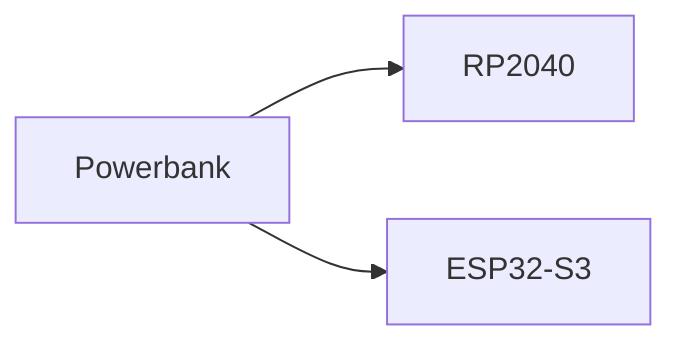
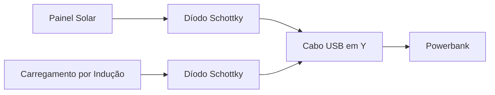
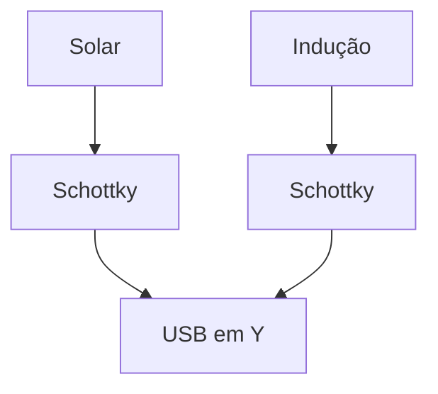

# Power System

> AEGIS - Energy Architecture

Versão: 1.0
Estado: Em desenvolvimento

---

# Objetivo

O sistema energético do AEGIS foi concebido para permitir operação autónoma prolongada, utilizando múltiplas fontes de energia.

A implementação será faseada:

1. Powerbank
2. Carregamento por indução
3. Integração solar

Cada etapa deverá ser validada antes da seguinte.

---

# Filosofia do Sistema

O AEGIS possui uma arquitetura energética modular.

Objetivos:

- alimentação estável dos sistemas eletrónicos
- carregamento autónomo
- redundância energética
- expansão futura para energia solar
- proteção contra retorno de corrente

---

# Arquitetura Atual

## Alimentação Principal

Hardware:

- Powerbank USB

Funções:

- alimentação do robô
- armazenamento de energia
- carregamento interno da bateria

---

## Fonte de Energia



---

# Sistema de Carregamento por Indução

## Objetivo

Permitir carregamento automático na estação base.

---

## Arquitetura


---

## Critérios de Sucesso

- carregamento iniciado automaticamente
- carregamento estável
- deteção correta do estado de carga

---

# Integração Solar (Fase Futura)

Estado:

Planeado

Dependências:

- validação completa da plataforma
- validação da estação de carga
- caracterização do consumo energético

---

# Arquitetura Futura



---

# Cabo USB em Y

## Objetivo

Combinar duas fontes independentes:

- painel solar
- carregamento por indução

num único ponto de entrada para o powerbank.

---

## Funcionalidade

```text
Painel Solar
      │
 Schottky
      │
      ├────► USB em Y ─────► Powerbank
      │
 Schottky
      │
Carregamento por Indução
```

---

# Díodos Schottky

## Objetivo

Impedir circulação de corrente entre fontes.

---

## Problema

Sem isolamento:

```text
Painel Solar
      │
      ├────────► Indução

ou

Indução
      │
      ├────────► Painel Solar
```

Podendo provocar:

- perdas energéticas
- aquecimento
- danos nos módulos

---

## Solução

Cada fonte possui um díodo Schottky dedicado.



---

# Evoluções Futuras

## Monitorização de Energia

Objetivos:

- tensão da bateria
- corrente de carga
- potência proveniente do painel solar
- ciclos de carregamento

---

## Gestão Inteligente de Energia

Possibilidades futuras:

- suspensão de serviços não essenciais
- redução de iluminação
- regresso antecipado à base
- otimização da utilização do painel solar

---

# Ordem de Implementação

```mermaid
