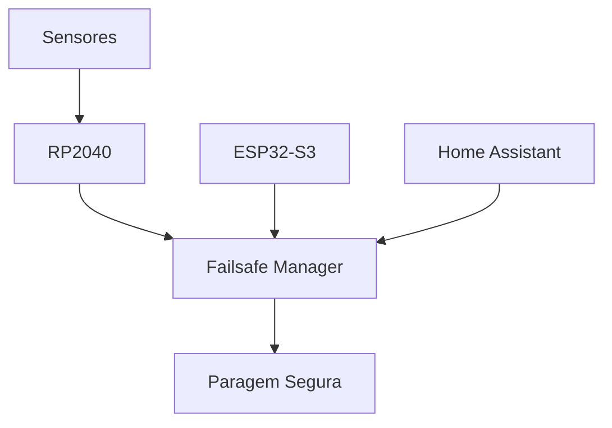
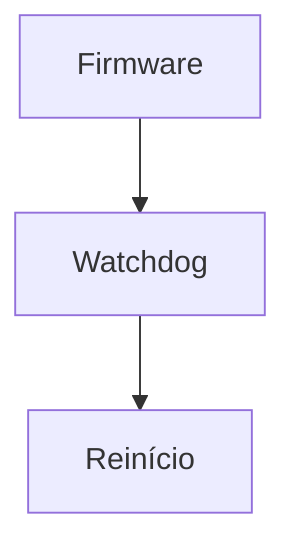
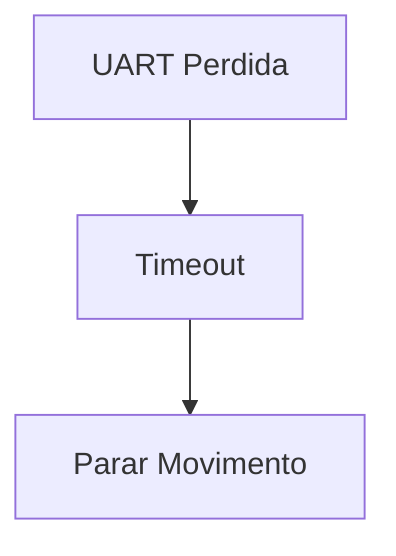
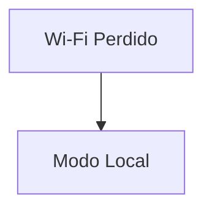
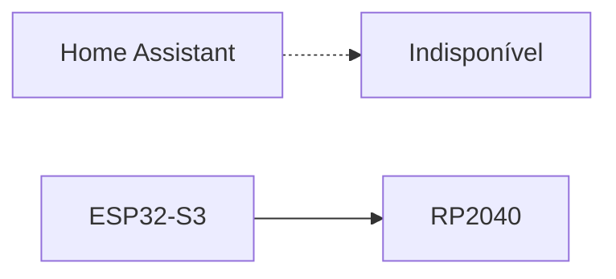
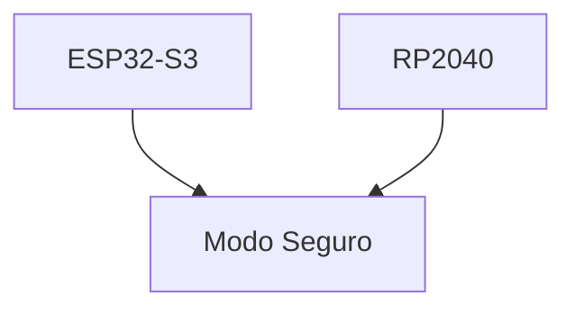
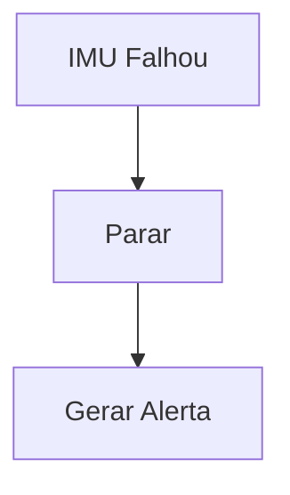
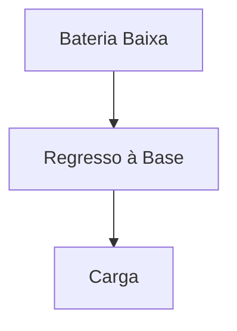
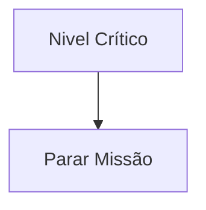
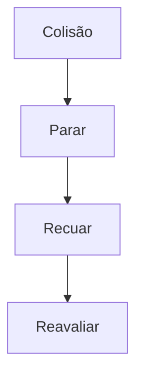

# Security and Failsafe System

> AEGIS - Safety, Reliability and Failure Management

Versão: 1.0
Estado: Arquitetura Definida

---

# Objetivo

Garantir que o AEGIS permanece seguro e previsível perante:

- falhas de hardware;
- falhas de software;
- falhas de comunicação;
- falhas energéticas;
- falhas de sensores;
- comportamentos inesperados.

A segurança tem prioridade sobre qualquer funcionalidade.

---

# Princípio Fundamental

Em caso de dúvida:

```text
PARAR É MELHOR DO QUE CONTINUAR
```

O robô nunca deve continuar uma operação quando não tem informação suficiente para a executar em segurança.

---

# Arquitetura de Segurança



---

# Níveis de Severidade

## Nível 1 - Aviso

O robô mantém operação normal.

Exemplos:

- perda momentânea de Wi-Fi;
- perda de telemetria;
- falha de entidade Home Assistant.

Ações:

- registar evento;
- notificar utilizador.

---

## Nível 2 - Degradação

O robô continua operacional com limitações.

Exemplos:

- falha de um microfone;
- falha da câmara;
- falha de um LED.

Ações:

- desativar funcionalidade afetada;
- continuar operação.

---

## Nível 3 - Segurança

Operação autónoma suspensa.

Exemplos:

- sensor crítico indisponível;
- navegação instável;
- colisões repetidas.

Ações:

- parar movimento;
- solicitar intervenção.

---

## Nível 4 - Crítico

Paragem imediata.

Exemplos:

- watchdog disparado;
- falha de controlador;
- problema energético grave.

Ações:

- corte de movimento;
- estado seguro.

---

# Watchdogs

## RP2040

Responsável:

- movimento;
- sensores.

---

## Objetivo

Detetar:

- firmware bloqueado;
- loops infinitos;
- perda de controlo.

---

## Estratégia



---

## ESP32-S3

Objetivo:

- supervisão de comunicações;
- supervisão de multimédia;
- supervisão ESPHome.

---

# Falha de Comunicação UART

## Cenário

Perda de comunicação RP2040 ↔ ESP32-S3.

---

## Comportamento



---

## Regra

O RP2040 nunca deve executar comandos antigos indefinidamente.

Após timeout:

- motores param;
- modo seguro ativado.

---

# Falha de Wi-Fi

## Cenário

ESP32-S3 perde ligação de rede.

---

## Comportamento



---

## Ações

Permitir:

- movimento local;
- docking;
- carregamento.

Desativar:

- streaming;
- comunicação remota;
- Assist.

---

# Falha do Home Assistant

## Cenário

Home Assistant indisponível.

---

## Comportamento



---

## Ações

O AEGIS continua operacional.

Manter:

- movimento;
- docking;
- carregamento.

Suspender:

- automações;
- dashboards;
- Assist.

---

# Falha do ESP32-S3

## Cenário

ESP32-S3 reinicia ou bloqueia.

---

## Ações

RP2040 assume modo seguro.



---

## Comportamento

- motores param;
- eliminar movimentos pendentes;
- aguardar recuperação.

---

# Falha do RP2040

## Cenário

Controlador de movimento falha.

---

## Consequência

Perda de capacidade de navegar.

---

## Ações

- desativar motores;
- gerar alerta;
- impedir novas missões.

---

# Falha do HC-SR04

## Comportamento

O robô entra em modo degradado.

Restrições:

- reduzir velocidade;
- desativar docking automático.

---

# Falha do MPU-6050

## Comportamento

Perda da referência inercial.

---

## Ações



---

# Falha dos Microfones

## Ações

- manter navegação;
- manter docking;
- manter vídeo.

Impacto:

- áudio degradado.

---

# Falha da Câmara

## Ações

- continuar navegação;
- continuar docking;
- continuar carregamento.

Impacto:

- vídeo indisponível.

---

# Gestão de Energia

## Bateria Baixa



---

## Bateria Crítica



---

## Falha de Carregamento

### Cenário

Docking bem sucedido mas sem carga.

---

### Ações

- nova tentativa de alinhamento;
- segunda tentativa;
- alerta ao utilizador.

---

# Colisões

## Deteção

Fontes:

- MPU-6050
- HC-SR04

---

## Comportamento



---

# Botão de Emergência

## Futuro

Possibilidade de adicionar:

- botão físico;
- comando remoto;
- entidade Home Assistant.

---

## Efeito

Paragem imediata.

---

# Modos Seguros

## Safe Mode

Permite:

- diagnóstico;
- telemetria;
- recuperação.

Impede:

- movimento.

---

## Recovery Mode

Permite:

- reiniciar módulos;
- efetuar testes;
- recuperar configurações.

---

# Requisitos de Segurança

O AEGIS não deverá:

- mover-se sem sensores críticos;
- executar docking sem referências válidas;
- continuar missão com bateria crítica;
- ignorar eventos de watchdog;
- executar comandos sem validação.

---

# Critérios de Validação

A arquitetura de segurança será considerada concluída quando:

- [ ] Watchdogs funcionam.
- [ ] Falhas UART são tratadas.
- [ ] Perda de Wi-Fi é tratada.
- [ ] Falha Home Assistant é tratada.
- [ ] Falha de sensores críticos é tratada.
- [ ] Colisões são tratadas.
- [ ] Bateria crítica força estado seguro.

---

# Regra de Ouro

A estabilidade e a segurança têm prioridade sobre:

- velocidade;
- funcionalidades;
- multimédia;
- automações.

Sempre que existir conflito entre funcionalidade e segurança:

```text
SEGURANÇA VENCE
```# Security and Failsafe System

> AEGIS - Safety, Reliability and Failure Management

Versão: 1.0
Estado: Arquitetura Definida

---

# Objetivo

Garantir que o AEGIS permanece seguro e previsível perante:

- falhas de hardware;
- falhas de software;
- falhas de comunicação;
- falhas energéticas;
- falhas de sensores;
- comportamentos inesperados.

A segurança tem prioridade sobre qualquer funcionalidade.

---

# Princípio Fundamental

Em caso de dúvida:

```text
PARAR É MELHOR DO QUE CONTINUAR
```

O robô nunca deve continuar uma operação quando não tem informação suficiente para a executar em segurança.

---

# Arquitetura de Segurança


---

# Níveis de Severidade

## Nível 1 - Aviso

O robô mantém operação normal.

Exemplos:

- perda momentânea de Wi-Fi;
- perda de telemetria;
- falha de entidade Home Assistant.

Ações:

- registar evento;
- notificar utilizador.

---

## Nível 2 - Degradação

O robô continua operacional com limitações.

Exemplos:

- falha de um microfone;
- falha da câmara;
- falha de um LED.

Ações:

- desativar funcionalidade afetada;
- continuar operação.

---

## Nível 3 - Segurança

Operação autónoma suspensa.

Exemplos:

- sensor crítico indisponível;
- navegação instável;
- colisões repetidas.

Ações:

- parar movimento;
- solicitar intervenção.

---

## Nível 4 - Crítico

Paragem imediata.

Exemplos:

- watchdog disparado;
- falha de controlador;
- problema energético grave.

Ações:

- corte de movimento;
- estado seguro.

---

# Watchdogs

## RP2040

Responsável:

- movimento;
- sensores.

---

## Objetivo

Detetar:

- firmware bloqueado;
- loops infinitos;
- perda de controlo.

---

## Estratégia


---

## ESP32-S3

Objetivo:

- supervisão de comunicações;
- supervisão de multimédia;
- supervisão ESPHome.

---

# Falha de Comunicação UART

## Cenário

Perda de comunicação RP2040 ↔ ESP32-S3.

---

## Comportamento


---

## Regra

O RP2040 nunca deve executar comandos antigos indefinidamente.

Após timeout:

- motores param;
- modo seguro ativado.

---

# Falha de Wi-Fi

## Cenário

ESP32-S3 perde ligação de rede.

---

## Comportamento


---

## Ações

Permitir:

- movimento local;
- docking;
- carregamento.

Desativar:

- streaming;
- comunicação remota;
- Assist.

---

# Falha do Home Assistant

## Cenário

Home Assistant indisponível.

---

## Comportamento


---

## Ações

O AEGIS continua operacional.

Manter:

- movimento;
- docking;
- carregamento.

Suspender:

- automações;
- dashboards;
- Assist.

---

# Falha do ESP32-S3

## Cenário

ESP32-S3 reinicia ou bloqueia.

---

## Ações

RP2040 assume modo seguro.


---

## Comportamento

- motores param;
- eliminar movimentos pendentes;
- aguardar recuperação.

---

# Falha do RP2040

## Cenário

Controlador de movimento falha.

---

## Consequência

Perda de capacidade de navegar.

---

## Ações

- desativar motores;
- gerar alerta;
- impedir novas missões.

---

# Falha do HC-SR04

## Comportamento

O robô entra em modo degradado.

Restrições:

- reduzir velocidade;
- desativar docking automático.

---

# Falha do MPU-6050

## Comportamento

Perda da referência inercial.

---

## Ações


---

# Falha dos Microfones

## Ações

- manter navegação;
- manter docking;
- manter vídeo.

Impacto:

- áudio degradado.

---

# Falha da Câmara

## Ações

- continuar navegação;
- continuar docking;
- continuar carregamento.

Impacto:

- vídeo indisponível.

---

# Gestão de Energia

## Bateria Baixa


---

## Bateria Crítica


---

## Falha de Carregamento

### Cenário

Docking bem sucedido mas sem carga.

---

### Ações

- nova tentativa de alinhamento;
- segunda tentativa;
- alerta ao utilizador.

---

# Colisões

## Deteção

Fontes:

- MPU-6050
- HC-SR04

---

## Comportamento


---

# Botão de Emergência

## Futuro

Possibilidade de adicionar:

- botão físico;
- comando remoto;
- entidade Home Assistant.

---

## Efeito

Paragem imediata.

---

# Modos Seguros

## Safe Mode

Permite:

- diagnóstico;
- telemetria;
- recuperação.

Impede:

- movimento.

---

## Recovery Mode

Permite:

- reiniciar módulos;
- efetuar testes;
- recuperar configurações.

---

# Requisitos de Segurança

O AEGIS não deverá:

- mover-se sem sensores críticos;
- executar docking sem referências válidas;
- continuar missão com bateria crítica;
- ignorar eventos de watchdog;
- executar comandos sem validação.

---

# Critérios de Validação

A arquitetura de segurança será considerada concluída quando:

- [ ] Watchdogs funcionam.
- [ ] Falhas UART são tratadas.
- [ ] Perda de Wi-Fi é tratada.
- [ ] Falha Home Assistant é tratada.
- [ ] Falha de sensores críticos é tratada.
- [ ] Colisões são tratadas.
- [ ] Bateria crítica força estado seguro.

---

# Regra de Ouro

A estabilidade e a segurança têm prioridade sobre:

- velocidade;
- funcionalidades;
- multimédia;
- automações.

Sempre que existir conflito entre funcionalidade e segurança:

```text
SEGURANÇA VENCE
```# Security and Failsafe System

> AEGIS - Safety, Reliability and Failure Management

Versão: 1.0
Estado: Arquitetura Definida

---

# Objetivo

Garantir que o AEGIS permanece seguro e previsível perante:

- falhas de hardware;
- falhas de software;
- falhas de comunicação;
- falhas energéticas;
- falhas de sensores;
- comportamentos inesperados.

A segurança tem prioridade sobre qualquer funcionalidade.

---

# Princípio Fundamental

Em caso de dúvida:

```text
PARAR É MELHOR DO QUE CONTINUAR
```

O robô nunca deve continuar uma operação quando não tem informação suficiente para a executar em segurança.

---

# Arquitetura de Segurança

```mermaid
flowchart TD

    SENSOR["Sensores"]
    RP["RP2040"]
    ESP["ESP32-S3"]
    HA["Home Assistant"]

    FAILSAFE["Failsafe Manager"]

    SENSOR --> RP
    RP --> FAILSAFE

    ESP --> FAILSAFE

    HA --> FAILSAFE

    FAILSAFE --> STOP["Paragem Segura"]
```

---

# Níveis de Severidade

## Nível 1 - Aviso

O robô mantém operação normal.

Exemplos:

- perda momentânea de Wi-Fi;
- perda de telemetria;
- falha de entidade Home Assistant.

Ações:

- registar evento;
- notificar utilizador.

---

## Nível 2 - Degradação

O robô continua operacional com limitações.

Exemplos:

- falha de um microfone;
- falha da câmara;
- falha de um LED.

Ações:

- desativar funcionalidade afetada;
- continuar operação.

---

## Nível 3 - Segurança

Operação autónoma suspensa.

Exemplos:

- sensor crítico indisponível;
- navegação instável;
- colisões repetidas.

Ações:

- parar movimento;
- solicitar intervenção.

---

## Nível 4 - Crítico

Paragem imediata.

Exemplos:

- watchdog disparado;
- falha de controlador;
- problema energético grave.

Ações:

- corte de movimento;
- estado seguro.

---

# Watchdogs

## RP2040

Responsável:

- movimento;
- sensores.

---

## Objetivo

Detetar:

- firmware bloqueado;
- loops infinitos;
- perda de controlo.

---

## Estratégia

```mermaid
flowchart TD

    RUN["Firmware"]

    WDT["Watchdog"]

    RESET["Reinício"]

    RUN --> WDT

    WDT --> RESET
```

---

## ESP32-S3

Objetivo:

- supervisão de comunicações;
- supervisão de multimédia;
- supervisão ESPHome.

---

# Falha de Comunicação UART

## Cenário

Perda de comunicação RP2040 ↔ ESP32-S3.

---

## Comportamento

```mermaid
flowchart TD

    UART["UART Perdida"]

    TIMER["Timeout"]

    STOP["Parar Movimento"]

    UART --> TIMER

    TIMER --> STOP
```

---

## Regra

O RP2040 nunca deve executar comandos antigos indefinidamente.

Após timeout:

- motores param;
- modo seguro ativado.

---

# Falha de Wi-Fi

## Cenário

ESP32-S3 perde ligação de rede.

---

## Comportamento

```mermaid
flowchart TD

    WIFI["Wi-Fi Perdido"]

    LOCAL["Modo Local"]

    WIFI --> LOCAL
```

---

## Ações

Permitir:

- movimento local;
- docking;
- carregamento.

Desativar:

- streaming;
- comunicação remota;
- Assist.

---

# Falha do Home Assistant

## Cenário

Home Assistant indisponível.

---

## Comportamento

```mermaid
flowchart LR

    HA["Home Assistant"]

    ESP["ESP32-S3"]

    RP["RP2040"]

    HA -.-> OFF["Indisponível"]

    ESP --> RP
```

---

## Ações

O AEGIS continua operacional.

Manter:

- movimento;
- docking;
- carregamento.

Suspender:

- automações;
- dashboards;
- Assist.

---

# Falha do ESP32-S3

## Cenário

ESP32-S3 reinicia ou bloqueia.

---

## Ações

RP2040 assume modo seguro.

```mermaid
flowchart TD

    ESP["ESP32-S3"]

    RP["RP2040"]

    SAFE["Modo Seguro"]

    ESP --> SAFE

    RP --> SAFE
```

---

## Comportamento

- motores param;
- eliminar movimentos pendentes;
- aguardar recuperação.

---

# Falha do RP2040

## Cenário

Controlador de movimento falha.

---

## Consequência

Perda de capacidade de navegar.

---

## Ações

- desativar motores;
- gerar alerta;
- impedir novas missões.

---

# Falha do HC-SR04

## Comportamento

O robô entra em modo degradado.

Restrições:

- reduzir velocidade;
- desativar docking automático.

---

# Falha do MPU-6050

## Comportamento

Perda da referência inercial.

---

## Ações

```mermaid
flowchart TD

    MPU["IMU Falhou"]

    STOP["Parar"]

    ALERT["Gerar Alerta"]

    MPU --> STOP

    STOP --> ALERT
```

---

# Falha dos Microfones

## Ações

- manter navegação;
- manter docking;
- manter vídeo.

Impacto:

- áudio degradado.

---

# Falha da Câmara

## Ações

- continuar navegação;
- continuar docking;
- continuar carregamento.

Impacto:

- vídeo indisponível.

---

# Gestão de Energia

## Bateria Baixa

```mermaid
flowchart TD

    LOW["Bateria Baixa"]

    HOME["Regresso à Base"]

    CHARGE["Carga"]

    LOW --> HOME

    HOME --> CHARGE
```

---

## Bateria Crítica

```mermaid
flowchart TD

    LOW["Nivel Crítico"]

    STOP["Parar Missão"]

    LOW --> STOP
```

---

## Falha de Carregamento

### Cenário

Docking bem sucedido mas sem carga.

---

### Ações

- nova tentativa de alinhamento;
- segunda tentativa;
- alerta ao utilizador.

---

# Colisões

## Deteção

Fontes:

- MPU-6050
- HC-SR04

---

## Comportamento

```mermaid
flowchart TD

    COLLISION["Colisão"]

    STOP["Parar"]

    BACK["Recuar"]

    RECHECK["Reavaliar"]

    COLLISION --> STOP

    STOP --> BACK

    BACK --> RECHECK
```

---

# Botão de Emergência

## Futuro

Possibilidade de adicionar:

- botão físico;
- comando remoto;
- entidade Home Assistant.

---

## Efeito

Paragem imediata.

---

# Modos Seguros

## Safe Mode

Permite:

- diagnóstico;
- telemetria;
- recuperação.

Impede:

- movimento.

---

## Recovery Mode

Permite:

- reiniciar módulos;
- efetuar testes;
- recuperar configurações.

---

# Requisitos de Segurança

O AEGIS não deverá:

- mover-se sem sensores críticos;
- executar docking sem referências válidas;
- continuar missão com bateria crítica;
- ignorar eventos de watchdog;
- executar comandos sem validação.

---

# Critérios de Validação

A arquitetura de segurança será considerada concluída quando:

- [ ] Watchdogs funcionam.
- [ ] Falhas UART são tratadas.
- [ ] Perda de Wi-Fi é tratada.
- [ ] Falha Home Assistant é tratada.
- [ ] Falha de sensores críticos é tratada.
- [ ] Colisões são tratadas.
- [ ] Bateria crítica força estado seguro.

---

# Regra de Ouro

A estabilidade e a segurança têm prioridade sobre:

- velocidade;
- funcionalidades;
- multimédia;
- automações.

Sempre que existir conflito entre funcionalidade e segurança:

```text
SEGURANÇA VENCE
```
