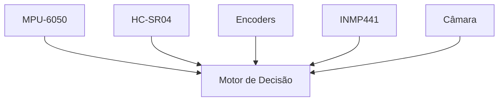
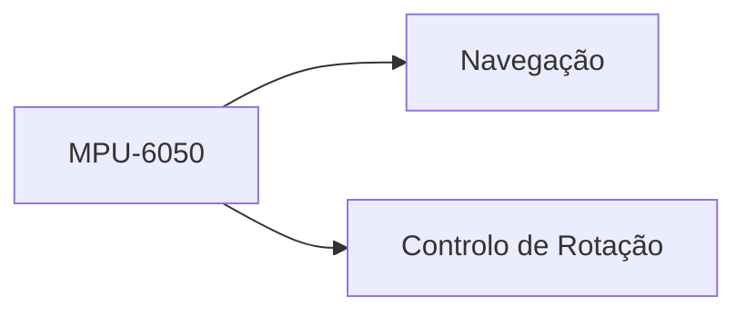
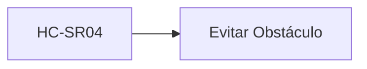
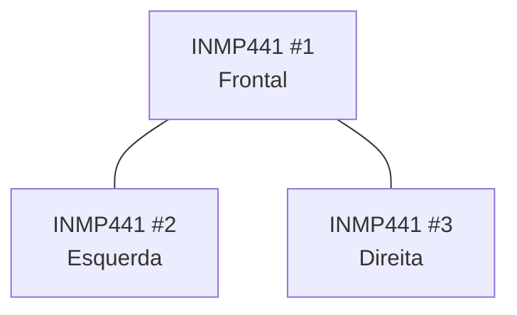
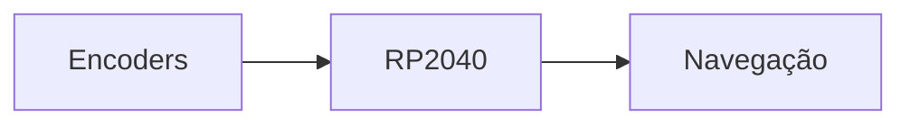
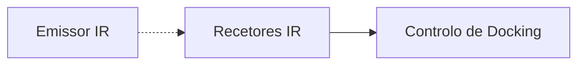
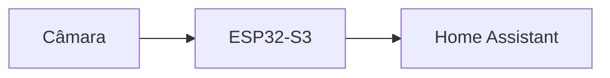

# Sensors

> AEGIS - Sensor Architecture

Versão: 1.0
Estado: Em desenvolvimento

---

# Objetivo

Este documento descreve todos os sensores utilizados pelo projeto AEGIS.

Inclui:

- sensores atuais
- sensores planeados
- função de cada sensor
- integração no sistema
- evolução futura

---

# Filosofia

Nenhum sensor é responsável sozinho pela tomada de decisão.

O AEGIS utiliza uma abordagem de fusão de sensores.

---

# Sensores Atuais

## MPU-6050

### Tipo

IMU (Inertial Measurement Unit)

### Interface

I²C

### Controlador

RP2040

### Funções

- medição de aceleração
- medição de orientação
- medição de rotação
- deteção de impactos
- estabilização da navegação

### Utilização no Projeto

---

## HC-SR04

### Tipo

Sensor ultrassónico

### Interface

Digital

### Controlador

RP2040

### Posição

Frente do robô

### Funções

- deteção de obstáculos
- aproximação controlada
- auxílio ao docking

### Utilização

---

# Sensores de Áudio

## INMP441

### Quantidade

3

### Tipo

Microfone MEMS I²S

### Interface

I²S

### Controlador

ESP32-S3

---

## Disposição Prevista

## Disposição Prevista

## Funções

### Curto Prazo

- deteção de som
- voz
- Assist

### Médio Prazo

- localização aproximada da origem sonora

### Longo Prazo

- seguimento acústico
- deteção inteligente de eventos

---

# Sensores Planeados

## Encoders

### Estado

Planeado

### Funções

- distância percorrida
- velocidade
- odometria
- apoio à navegação

---

## Arquitetura

---

# Sensores de Docking

## Recetores IR

### Estado

Planeado

### Funções

- deteção da base
- alinhamento
- aproximação final

---

### Arquitetura

---

# Sensores de Visão

## Câmara

### Estado

Planeado

### Funções

- vigilância
- streaming remoto
- reconhecimento da estação de carga
- navegação visual

---

## Integração Prevista

---

# Mapa de Sensores por Subsistema

## Movimento

| Sensor | Função |
|----------|----------|
| MPU-6050 | Orientação |
| HC-SR04 | Obstáculos |
| Encoders | Odometria |

---

## Docking

| Sensor | Função |
|----------|----------|
| IR | Localização da base |
| HC-SR04 | Distância final |
| Câmara | Alinhamento futuro |

---

## Vigilância

| Sensor | Função |
|----------|----------|
| Câmara | Vídeo |
| INMP441 | Áudio |

---

## Interação

| Sensor | Função |
|----------|----------|
| INMP441 | Voz |
| Câmara | Presença |

