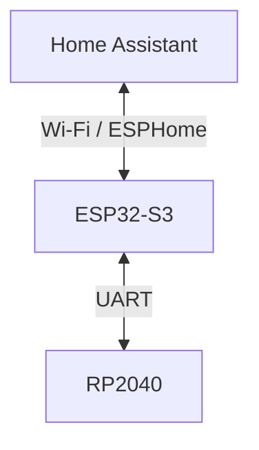
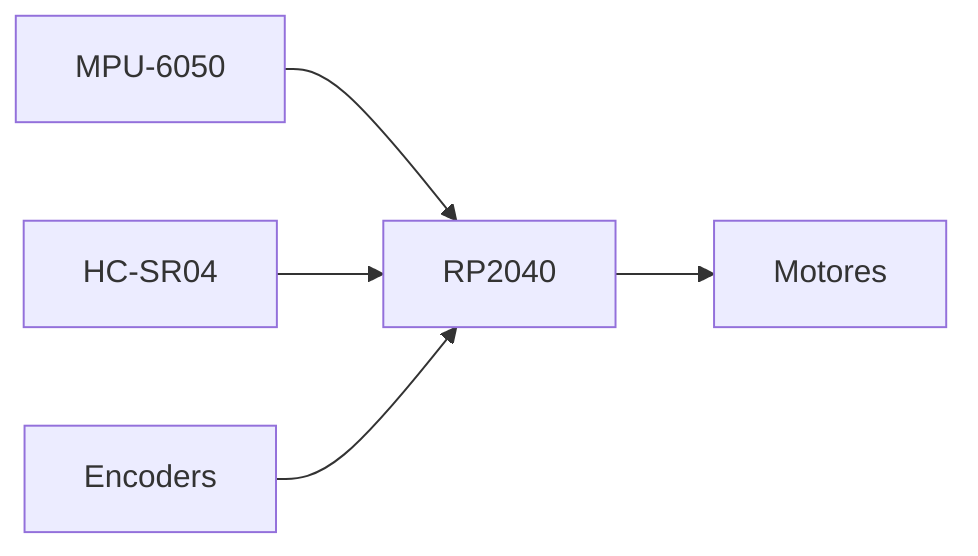
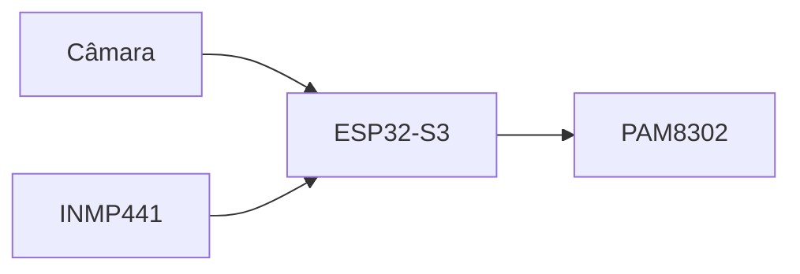
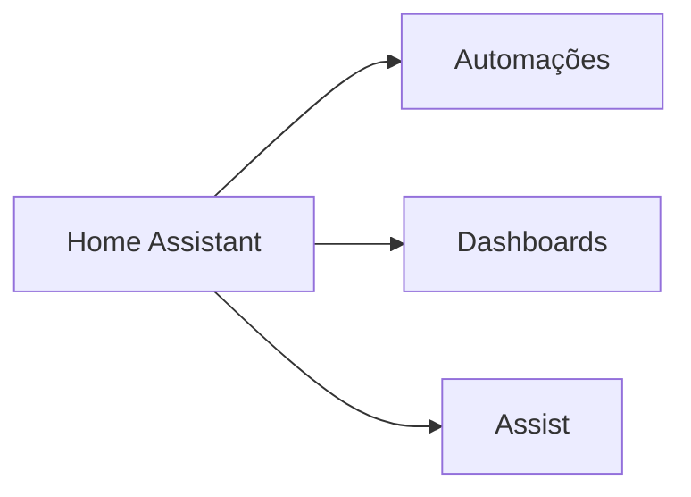

# Software Roadmap

> AEGIS - Software Architecture and Development Plan

Versão: 1.0
Estado: Em desenvolvimento

---

# Objetivo

Definir a evolução do software do AEGIS desde a primeira plataforma motora até ao robô autónomo totalmente integrado com Home Assistant.

A arquitetura segue uma filosofia distribuída:

- RP2040 para controlo em tempo real
- ESP32-S3 para coordenação e comunicações
- Home Assistant para automações e supervisão

---

# Arquitetura Global



---

# Responsabilidades

## RP2040

Funções de tempo real.



### Responsabilidades

- controlo de motores
- leitura de sensores de movimento
- controlo do servo
- prevenção de colisões
- navegação local
- telemetria

---

## ESP32-S3

Controlador principal.



### Responsabilidades

- comunicação Wi-Fi
- ESPHome
- Home Assistant
- gestão energética
- câmara
- áudio
- coordenação global

---

## Home Assistant

Supervisor do sistema.



### Responsabilidades

- automações
- notificações
- histórico
- dashboards
- assistente de voz
- lógica avançada

---

# Roadmap por Fases

---

# Fase 1 - Plataforma Motora

Estado:
- Próxima fase

Objetivo:

Criar base funcional de movimento.

---

## Funcionalidades

### RP2040

- inicialização
- controlo dos motores
- travagem
- curvas
- leitura HC-SR04
- leitura MPU-6050

---

## Testes

- movimento frente
- movimento trás
- rotação esquerda
- rotação direita
- paragem
- deteção de obstáculos

---

# Fase 2 - Navegação Básica

Objetivo:

Movimento inteligente.

---

## Funcionalidades

### RP2040

- controlo orientado por IMU
- curvas com ângulo alvo
- limitação de velocidade
- prevenção de colisões

---

## Futuro

- encoders
- correção de trajetória

---

# Fase 3 - Integração ESP32-S3

Objetivo:

Separação definitiva entre movimento e lógica.

---

## Funcionalidades

### UART

Comandos previstos:

```text
MOVE_FORWARD
MOVE_BACKWARD
TURN_LEFT
TURN_RIGHT
STOP
DOCK
PATROL
```

---

### Telemetria

```text
BATTERY
DISTANCE
ANGLE
STATUS
```

---

# Fase 4 - Home Assistant

Objetivo:

Tornar o AEGIS um dispositivo da casa inteligente.

---

## Entidades ESPHome

```yaml
sensor:
  - battery
  - sound_level
  - distance

binary_sensor:
  - obstacle
  - charging

switch:
  - patrol_mode

button:
  - return_to_base
```

---

## Automações

Exemplos:

```text
Bateria baixa
↓
Regresso à base
```

```text
Modo ausência
↓
Iniciar patrulha
```

---

# Fase 5 - Sistema de Docking

Objetivo:

Regresso automático à estação.

---

## Funcionalidades

### RP2040

- procura local
- alinhamento
- aproximação

### ESP32-S3

- supervisão
- estado

### Home Assistant

- monitorização
- alertas

---

# Fase 6 - Áudio

Objetivo:

Interação sonora.

---

## Hardware

- INMP441
- PAM8302
- Altifalantes

---

## Funcionalidades

### Inicial

- reprodução de alertas
- anúncios

### Intermédia

- streaming áudio
- intercomunicador

### Avançada

- localização de som
- resposta inteligente

---

# Fase 7 - Assist

Objetivo:

Utilização do Assist do Home Assistant.

---

## Fluxo

```mermaid
flowchart LR
